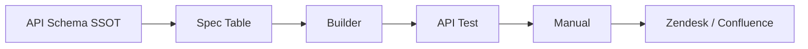
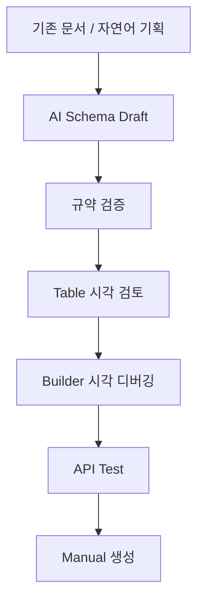
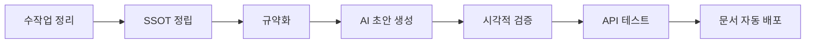

# 사람 중심 업무 체계를 AI 이해 가능 구조로 재구성


1. 대전제
AI 활용의 한계는 AI 모델이 아니라 업무 구조에서 발생한다

AI를 업무에 붙이는 것만으로는 자동화가 잘 되지 않는다.

기존 업무는 대부분 사람이 경험으로 판단하고, 문서를 읽고, 기억으로 검증하고, 여러 도구에 나눠서 처리하는 방식이다.
이 구조에서는 AI가 업무를 안정적으로 이해하거나 검증하기 어렵다.

그래서 먼저 해야 하는 일은 AI 기능을 추가하는 것이 아니라, 업무 체계 자체를 AI가 해석할 수 있는 구조로 바꾸는 것이다.

대전제 한 문장

사람의 경험과 기억에 의존하던 업무 체계를 AI가 해석하고, 생성하고, 검증할 수 있는 구조로 전환한다.

조금 더 발표 제목처럼 다듬으면:

사람 중심 업무 체계를 AI 해석·검증 가능 구조로 전환

이 표현이 가장 좋습니다.

“AI 이해 가능”도 괜찮지만 조금 부드럽고 추상적입니다.
이번 발표에서는 단순 이해가 아니라 생성, 검증, 테스트, 문서 배포까지 가기 때문에 AI 해석·검증 가능 구조가 더 정확합니다.

2. 이번 발표의 실제 사례

대전제는 크지만, 발표에서는 이걸 추상적으로만 말하면 안 됩니다.

그래서 구체적인 사례로 API 기획 업무를 사용합니다.

이번 사례의 핵심은 다음입니다.

API 기획, Schema 작성, Table 검토, Builder 확인, API Test, Manual 배포까지 이어지는 업무 흐름을 하나의 기준 데이터, 즉 API Schema SSOT로 연결했다.

즉, 발표의 구조는 이렇게 잡으면 됩니다.

대전제
사람 중심 업무 체계를 AI 해석·검증 가능 구조로 전환해야 한다.
        ↓
사례
API 기획 업무를 API Schema SSOT 기반으로 재구성했다.
        ↓
결과
AI가 초안을 만들고, 사람은 시각적으로 검토하고, 실제 API와 Manual까지 검증 가능한 흐름을 만들었다.
3. 발표 핵심 메시지

이 발표의 핵심은 API 자동화 자체가 아닙니다.

핵심은 다음입니다.

AI를 제대로 활용하려면 사람이 암묵적으로 처리하던 업무 지식, 판단 기준, 검증 절차를 데이터와 규약으로 바꿔야 한다.

API Schema SSOT는 그걸 구현한 사례입니다.

기존에는 기획자가 제품을 이해하고, API 구조를 파악하고, 문서를 작성하고, 테스트하고, 매뉴얼까지 따로 확인했습니다.

전환 후에는 API Schema를 기준으로 다음 흐름을 연결했습니다.

API Schema SSOT
   ↓
Spec Table
   ↓
Builder
   ↓
API Test
   ↓
Manual
   ↓
Zendesk / Confluence
4. 발표 전체 흐름

발표는 아래 순서로 가면 가장 자연스럽습니다.

1. 왜 이 문제가 생겼는가
2. 왜 단순 AI 자동화로는 해결되지 않는가
3. 그래서 어떤 기준점이 필요했는가
4. API Schema SSOT를 어떻게 만들었는가
5. Spec → Table → Builder → API Test → Manual 흐름
6. AI는 어디에 들어가는가
7. 이 방식이 기획 업무에 주는 가치
8. 앞으로 중국 개발기획자와 확장할 수 있는 방향


[Why]
1. AI는 생성할 수 있지만, 검증할 수 있는 구조가 필요한가?
2. 기존 업무는 왜 AI 활용에 한계가 있었는가?
3. 기존 업무의 Pain Point는 무엇인가?
4. 왜 AI에는 별도의 규격화와 검증 시스템이 필요한가?


Slide 1. 제목
사람 중심 업무 체계를 AI 해석·검증 가능 구조로 전환

아이스브레이킹 한 이미지로 비유하는 이미지
오늘 발표는 단순히 API 도구를 소개하는 자리가 아니다.
AI를 실제 업무에 적용하려면 업무 자체를 어떻게 구조화해야 하는지, API 기획 업무 사례를 통해 설명한다.

“자동 조종 비행기인데 계기판이 없는 상황”
자동 조종 비행기
하지만 조종석에는 계기판 없음
속도, 고도, 방향, 경고 상태를 확인할 수 없음


화면 문장

AI는 만들 수 있다.
하지만 우리는 그것이 맞는지 어떻게 확인할 것인가?


말할 내용

오늘 발표는 단순히 API 도구를 소개하는 자리가 아니다.

AI를 실제 업무에 적용하려면 먼저 업무 자체가 바뀌어야 한다.
사람이 경험과 기억으로 처리하던 업무를 AI가 해석할 수 있고, 사람이 검증할 수 있는 구조로 바꿔야 한다.

자동 조종 비행기도 계기판과 관제 시스템이 있어야 신뢰할 수 있다.
AI도 마찬가지다. 결과를 생성하는 것보다, 그 결과가 맞는지 확인할 수 있는 구조가 중요하다.

이번 발표에서는 API 기획 업무를 사례로, 업무를 어떻게 구조화했고, Schema를 중심으로 어떻게 시각적 검증과 Manual 자동화까지 연결했는지 설명한다.


Slide 2. 문제의 출발점
1. 사람의 경험과 기억에 의존한다.
2. 도구들이 서로 단절되어 있다.
3. 정보와 판단 기준이 누적되지 않는다.

 -------- 아래에 대해 하나씩 아이콘이 있어서 연결이 끊겨있는 이미지 작성 --------
MIDAS GEN NX/ CIVIL NX
Postman
Confluence
Jira
Zendesk
개발 코드
개인 문서
개인 메모
→ 업무의 정보와 실행 절차를 AI가 해석 가능한 구조로 규격화
-----------------------------------------------------------------------


Slide 3. 기존 업무의 Pain Point

테이블 
문제	설명
기준 불일치	문서, Schema, Builder, 실제 API가 다를 수 있음
담당자 의존	왜 그렇게 설계했는지 히스토리가 개인 기억에 남음
검증 누락	스키마만 작성하다 보면 누락된 정보들을 파악하기 힘듬 
문서 작성 업무 비효율	ZENDESK의 불편함과 검증 스키마 작성후 따로 메뉴얼 작성을 위한 과도한 시간 소모


Slide 4. AI는 “생성”보다 “검증 구조”가 중요한가
AI는 똑똑하지만,
실무에서는 사전 규약과 검증 시스템 없이 신뢰하기 어렵다.

가이드와 검증시스템이 필요하다
-> 하지만 어떻게


Slide 5. 기획자로써 바이브코딩


* 점진적 자동화 전략
업무가 바쁘다 하지만 업무의 효율화가 필요 -> 작은 단위의 검증 가능한 흐름을 조립하는 방식으로 접근

* 바이브코딩은 단순 빠른 개발 X -> 실무 아이디어를 빠르게 검증하기 위한 실험

사고의 흐름대로 아이디어를 도출하고 바이브 코딩으로 시각화
API 기획 반복업무를 자동화하자 
문서 자동화필요 (메뉴얼 웹 자동화) ->  문서의 규칙정의 필요 (SSOT)
-> AI에 적합하게 설계 MCP ->  제품 정보 필요 (제품C++ MCP) -> 하나로 묶는 통합 필요 (CLI)
-> 검증 필요 (시각화 검증 툴) -> 협업을 위한 공유 필요 (DB) 


CLI -> SKILL, MCP호출 -> 스키마 작성 -> 검증, 메뉴얼툴 


--------- 두가지의 플로우를 위아래를 두고 비교 하는 이미지 ---------
파트1 제품 파악 C++기반 제품의 DB구축
파트2 스키마의 작성 SSOT기반으로한 MCP 구축
파트3 검증 시각화
파트4 검증에서 메뉴얼 전환을 자동화
위의 파트를 아래의 수평 플로우의 그룹을 지어서 영겨 색을 넣어서 감싸줘


### 기존 기획 업무 흐름

```text
제품 파악
   ↓
기존 API 구조 파악
   ↓
스키마 작성
   ↓
개발
   ↓
검증
   ↓
메뉴얼 작성
```

### 전환 후 업무 흐름

```text
제품 DB / 정보 시스템
   ↓
API SSOT
   ↓
LLM 스키마 작성
   ↓
개발
   ↓
AI 검증
   ↓
메뉴얼 배포
--------------------------------------------------------

Slide 6. 전체 구조


## AI 자동화와 API Schema SSOT 발표 초안

대상: 중국 개발기획자  
주제: 사람 중심 업무 체계를 AI가 이해 가능한 구조로 재구성한 경험과 API 도구 사례  
목표 시간: 20~30분

---

## 1. 발표의 핵심 메시지

이 발표의 중심은 API 자체가 아니다.

API 도구는 하나의 구체적인 사례일 뿐이고, 더 중요한 주제는 다음 질문이다.

> 기존의 사람 중심 업무 체계를 왜 AI가 이해 가능한 구조로 바꿔야 했고, 그 과정에서 무엇을 고민했으며, 실제로 어떻게 바꿨는가?

따라서 이 발표는 "API 문서를 자동화했다"는 기능 소개가 아니라, AI를 업무에 적용하기 위해 업무 자체를 어떻게 재설계했는지에 대한 이야기로 잡는다.

대주제는 다음 한 문장으로 잡는다.

> 사람의 경험과 기억에 의존하던 업무를 AI가 이해하고, 생성하고, 검증할 수 있는 구조로 재구성한다.

핵심 메시지는 다음과 같다.

> AI 활용의 핵심은 AI 기능을 붙이는 것이 아니라, 사람이 암묵적으로 처리하던 업무 지식, 판단 기준, 검증 절차를 AI가 읽을 수 있는 데이터와 규약으로 바꾸는 것이다. 이 프로젝트에서는 그 구체적인 사례로 API 기획 업무를 선택했고, 제품 정보와 API 구조를 SSOT로 정리한 뒤, LLM 스키마 작성, 시각적 검증, API 테스트, Manual 배포까지 이어지는 흐름을 만들었다.

중국 개발기획자에게 전달해야 할 포인트는 기술 구현 자체보다 다음 세 가지다.

1. 왜 기존 사람 중심 업무 방식은 AI 활용에 한계가 있는가
2. AI가 잘 작동하려면 업무 지식을 어떤 구조로 바꿔야 하는가
3. 어떻게 작은 자동화 단위에서 시작해 실제 업무 흐름으로 조립할 수 있는가

이 발표에서 API, Schema, Zendesk, Postman 같은 단어는 핵심 주제가 아니라 설명을 위한 사례다. 핵심은 "어떤 업무든 AI가 이해 가능한 구조로 바꾸지 않으면 AI 활용은 단발성 실험에 머문다"는 점이다.

---

## 2. 업무 전환 프레임

이번 발표는 단순히 도구를 소개하는 발표가 아니라, 업무 체계의 전환을 설명하는 발표로 잡는다.

범용적으로 보면 전환 방향은 다음과 같다.

```text
사람이 경험으로 해석하는 업무
   ↓
업무 지식과 판단 기준을 구조화
   ↓
AI가 읽고 생성할 수 있는 데이터로 변환
   ↓
사람이 검토 가능한 화면과 절차로 검증
   ↓
실제 업무 산출물로 배포
```

이 흐름을 API 기획 업무에 적용하면 아래와 같은 전환이 된다.

### 기존 기획 업무 흐름

```text
제품 파악
   ↓
기존 API 구조 파악
   ↓
스키마 작성
   ↓
개발
   ↓
검증
   ↓
메뉴얼 작성
```

기존 흐름은 사람이 제품과 API 구조를 파악하고, 그 이해를 바탕으로 스키마와 문서를 작성하는 방식이다. 이 방식은 초기에는 빠르게 보이지만, API가 많아지고 담당자가 바뀌면 구조와 규칙이 사람마다 달라진다.

### 전환 후 업무 흐름

```text
제품 DB / 정보 시스템
   ↓
API SSOT
   ↓
LLM 스키마 작성
   ↓
개발
   ↓
AI 검증
   ↓
메뉴얼 배포
```

전환 후에는 사람이 매번 처음부터 해석하는 대신, 제품 정보와 API 정보를 AI가 이해 가능한 구조로 정리한다. 그 중심에 API SSOT를 두고, LLM은 이 기준을 바탕으로 스키마 초안을 만들며, 검증 도구는 실제 API 동작과 문서 반영까지 확인한다.

핵심 변화는 다음과 같다.

| 기존 | 전환 후 |
|---|---|
| 사람이 API 구조를 해석 | 시스템이 API 구조를 기준 데이터로 관리 |
| 담당자별 규칙 차이 발생 | SSOT와 규약으로 판단 기준 통일 |
| 히스토리가 개인 기억에 남음 | 변경 이력과 검증 결과가 데이터로 축적 |
| 문서 작성이 마지막 수작업 | 검증된 데이터에서 Manual 생성 |
| 도구가 분리됨 | 기획, 검증, 문서 흐름을 하나로 연결 |

---

## 3. 전체 인사이트: 작은 단위로 쪼개고, 프로토타입으로 검증한 뒤 조립한다

이 프로젝트의 중요한 인사이트는 거대한 시스템을 한 번에 만든 것이 아니라는 점이다.

업무를 작은 단위로 나누고, 각 단위를 빠르게 프로토타입으로 만들고, 실제 업무에서 테스트한 뒤, 검증된 조각을 다시 조립했다.

```text
큰 문제
   ↓
작은 업무 단위로 분해
   ↓
바이브 코딩으로 빠른 프로토타입 제작
   ↓
실제 API와 실제 문서로 테스트
   ↓
쓸모 있는 기능만 남김
   ↓
SSOT 흐름 안에 조립
```

여기서 바이브 코딩은 목적이 아니라 방법이다. 중요한 것은 빠르게 만들고, 실제 업무에서 바로 확인하고, 맞지 않는 부분을 버리거나 수정하는 반복 구조다.

예를 들면 다음과 같이 쪼갤 수 있다.

- 기존 문서에서 API 정보 추출
- Schema 초안 생성
- Required / Optional 규칙 확인
- Table View로 사람이 검토
- Builder로 입력 UI 확인
- API Test로 실제 동작 확인
- Zendesk / Confluence Manual 업데이트
- ko, en-us, jp 등 언어별 배포 확인

각 기능은 작지만, SSOT를 기준으로 연결하면 전체 업무 흐름이 된다.

발표에서 줄 수 있는 가장 큰 메시지는 다음이다.

> AI 자동화는 거대한 완성품을 한 번에 만드는 방식보다, 사람이 반복하던 작은 판단과 변환을 구조화하고 검증 가능한 단위로 자동화한 뒤 조립하는 방식이 현실적이다.

---

## 4. 기존 업무의 Pain Point

### Pain Point 1. 기존 API 구조 파악이 사람마다 달라진다

기존 업무에서는 기획자가 먼저 제품을 파악하고 기존 API 구조를 이해해야 한다. 하지만 API 구조, 필드 규칙, 예외 처리 방식이 명확한 기준 데이터로 남아 있지 않으면 사람마다 해석이 달라진다.

예를 들어 같은 필드를 보더라도 담당자마다 다르게 판단할 수 있다.

- 어떤 사람은 Required로 이해한다.
- 어떤 사람은 Optional로 이해한다.
- 어떤 사람은 Builder에서 숨겨야 한다고 판단한다.
- 어떤 사람은 Manual에만 설명하면 된다고 판단한다.

이 차이는 개인의 실수라기보다 기준 데이터가 없는 구조에서 자연스럽게 발생하는 문제다.

### Pain Point 2. 히스토리가 남지 않는다

담당자가 변경되면 다음 정보가 사라지기 쉽다.

- 왜 이 필드가 Required인지
- 왜 특정 enum 값이 제외되었는지
- 왜 Builder에서는 숨기지만 API Schema에는 남겨두었는지
- 실제 API 테스트에서 어떤 문제가 있었는지
- Manual 문구가 왜 그렇게 작성되었는지

결과적으로 새 담당자는 다시 제품을 파악하고, 기존 API를 다시 읽고, Postman으로 다시 검증해야 한다.

이 문제를 해결하려면 결과물뿐 아니라 판단 근거와 검증 결과가 데이터로 남아야 한다.

### Pain Point 3. Zendesk 기반 HTML 작성이 불편하다

Manual 작성은 사용자에게 보이는 중요한 산출물이지만, Zendesk HTML을 직접 작성하고 관리하는 방식은 기획 업무에 부담이 크다.

불편한 지점은 다음과 같다.

- HTML 구조를 직접 신경 써야 한다.
- API 변경 사항을 문서에 다시 반영해야 한다.
- 코드 블록, 테이블, 경고 문구 같은 형식을 반복 작성해야 한다.
- 언어별 문서를 따로 확인해야 한다.
- URL의 locale에 따라 특정 언어만 업데이트될 수 있다.

Manual은 마지막에 사람이 다시 쓰는 문서가 아니라, 앞 단계에서 검증된 API 정보를 기반으로 생성되어야 한다.

### Pain Point 4. 도구가 파편화되어 있다

현재 업무는 여러 도구에 나뉘어 있다.

```text
제품
Postman
Confluence
Jira
Zendesk
개발 코드
개별 문서
개인 메모
```

도구가 많다는 것 자체가 문제는 아니다. 문제는 도구 사이의 기준 데이터가 연결되어 있지 않다는 점이다.

예를 들어 Jira에는 이슈가 있고, Confluence에는 기획 문서가 있고, Postman에는 테스트가 있고, Zendesk에는 Manual이 있지만, 이들이 같은 API Schema를 기준으로 연결되어 있지 않으면 변경 추적이 어렵다.

따라서 이 프로젝트의 방향은 모든 도구를 하나로 없애는 것이 아니라, 각 도구를 API SSOT 기준으로 연결하는 것이다.

---

## 5. 발표 제목 후보

### 후보 1

사람 중심 업무 체계를 AI 이해 가능 구조로 재구성

### 후보 2

AI 기반 API 업무 자동화: Schema SSOT에서 Manual까지

### 후보 3

Spec에서 Manual까지: AI와 규약 기반 API 검증 흐름 만들기

추천 제목:

> 사람 중심 업무 체계를 AI 이해 가능 구조로 재구성

---

## 6. 발표 구조

전체 발표는 다음 흐름으로 잡는다.

```text
기존 업무의 Pain Point
        ↓
AI를 바로 쓰기 어려웠던 이유
        ↓
API Schema SSOT라는 기준점
        ↓
Spec → Table → Builder → API Test → Manual 순차 검증
        ↓
AI가 들어가는 위치
        ↓
기획툴로서의 가치
        ↓
점진적 자동화 전략
        ↓
중국 개발기획자와 함께 확장할 수 있는 방향
```

---

## 7. 도입: 왜 이걸 만들게 되었는가

### 기존 업무 상황

API 기획과 검증 업무는 겉으로 보기에는 문서 작성 업무처럼 보인다. 하지만 실제로는 다음 정보를 계속 맞춰야 하는 복합 업무다.

- API 경로와 HTTP Method
- Request / Response Schema
- 필수값, 선택값, 기본값
- 조건부 표시와 조건부 필수값
- Spec Table
- Builder UI 입력 방식
- 실제 API 호출 결과
- Zendesk / Confluence Manual
- 다국어 문서

문제는 이 정보들이 하나의 기준에서 관리되지 않고 여러 위치에 흩어져 있다는 점이다.

### 기존 업무 한계

기존 방식에서는 기획자가 문서를 보고, 개발자가 구현하고, QA 또는 기획자가 다시 API를 테스트하고, 문서 담당자가 매뉴얼을 업데이트한다.

이 흐름에서는 다음 문제가 반복된다.

- 문서에는 Required라고 되어 있지만 실제 API는 Optional처럼 동작한다.
- Table에는 기본값이 있지만 Builder UI에는 반영되지 않는다.
- Builder에서는 입력 가능하지만 실제 API 호출에서는 실패한다.
- API가 변경되어도 Manual은 이전 상태로 남는다.
- 영어 문서만 업데이트되고 한국어 문서는 누락된다.
- 담당자가 바뀌면 왜 그렇게 설계되었는지 추적하기 어렵다.
- 많은 API를 사람이 반복 확인해야 해서 시간과 품질이 모두 불안정하다.

발표에서는 이 부분을 "불편함"이 아니라 "업무 구조의 한계"로 설명하는 것이 좋다.

> 문제는 사람이 실수한다는 것이 아니라, 사람이 매번 같은 정보를 여러 위치에 다시 입력해야 하는 구조에 있다.

---

## 8. Pain Point 상세 정리

### Pain Point 1. 정보가 분산되어 있다

같은 API 정보가 여러 곳에 존재한다.

```text
기획 문서
API Schema
Spec Table
Builder UI
API Test Case
Manual
Zendesk / Confluence
```

각 위치가 따로 관리되면 한 곳만 수정되고 나머지는 누락될 수 있다.

### Pain Point 2. 검증이 사람의 기억에 의존한다

기획자는 다음 질문을 계속 확인해야 한다.

- 이 필드는 정말 Required인가?
- 기본값은 어디에서 온 것인가?
- Builder에서 숨겨야 하는 조건은 무엇인가?
- 실제 API도 같은 규칙으로 동작하는가?
- 문서에는 이 변경이 반영되었는가?

이 질문이 도구 안에서 자동으로 이어지지 않으면, 결국 담당자의 기억과 수작업 체크리스트에 의존하게 된다.

### Pain Point 3. AI가 만든 결과를 그대로 믿기 어렵다

AI는 빠르게 초안을 만들 수 있지만, API 기획에서는 다음 문제가 있다.

- 필드명을 잘못 해석할 수 있다.
- 조건부 필수값을 누락할 수 있다.
- enum 값을 임의로 보정할 수 있다.
- 실제 API 동작과 다른 문서를 만들 수 있다.
- Manual 문장은 자연스럽지만 Schema와 맞지 않을 수 있다.

따라서 AI를 바로 최종 산출물 생성기로 쓰면 위험하다.

이 프로젝트의 접근은 다르다.

> AI는 초안을 만들고, SSOT와 규약이 검증한다.

### Pain Point 4. 다국어 문서 업데이트가 불안정하다

API Manual은 하나의 언어만 맞으면 끝나는 업무가 아니다.

예를 들어 Zendesk Manual에서는 다음 언어가 같이 관리되어야 한다.

- ko
- en-us
- jp

기존에는 특정 URL이 `en-us`를 가리키면 영어 문서만 업데이트되고, 한국어 문서가 누락될 수 있다. 이 문제는 API 정보 자체의 문제라기보다 "문서 배포 단계까지 SSOT 흐름이 이어지지 않는 문제"다.

---

## 9. 왜 AI를 활용했는가

AI를 활용한 이유는 "사람을 대체하기 위해서"가 아니다.

활용 목적은 다음과 같다.

1. 반복적인 초안 작성 시간을 줄인다.
2. 기존 문서에서 Schema 후보를 빠르게 추출한다.
3. 기획자가 자연어로 작성한 규칙을 구조화한다.
4. 누락 가능성이 높은 Required, enum, default, conditional rule을 자동 점검한다.
5. Manual 문서 초안을 같은 기준에서 생성한다.

AI가 잘하는 영역과 사람이 책임져야 하는 영역을 분리한다.

| 구분 | AI가 담당 | 사람이 담당 |
|---|---|---|
| 초안 생성 | Schema, Table, Manual 초안 생성 | 최종 의미 판단 |
| 반복 변환 | Spec → Table → Manual 변환 보조 | 도메인 규칙 확인 |
| 누락 탐지 | Required, enum, default 후보 탐지 | 실제 정책 확정 |
| 문장화 | 사용자용 설명 문장 생성 | 표현과 책임 범위 확정 |
| 검증 | 규약 기반 자동 체크 보조 | API 실제 동작 판단 |

---

## 10. 왜 SSOT가 필요한가

SSOT는 Single Source of Truth의 약자다.

이 프로젝트에서는 API Schema를 업무의 기준점으로 둔다.

```text
API Schema
   ↓
Spec Table
   ↓
Builder
   ↓
API Test
   ↓
Manual
```

중요한 것은 Schema가 단순한 JSON 구조 설명이 아니라는 점이다.

Schema는 다음 정보를 함께 담아야 한다.

- 필드 타입
- Required / Optional
- 기본값
- enum
- enum label
- 조건부 표시
- 조건부 필수값
- Request / Response 구조
- Builder UI 생성에 필요한 정보
- Manual 생성에 필요한 설명 정보

즉, Schema는 개발자만 보는 기술 파일이 아니라 기획, 개발, 테스트, 문서를 연결하는 기준 데이터가 된다.

---

## 11. 전체 흐름: Spec → Table → Builder → API Test → Manual

### 1단계. Spec

Spec 단계는 API의 의도를 정의하는 단계다.

여기서 결정해야 하는 것은 단순히 필드 목록이 아니다.

- 어떤 값이 들어갈 수 있는가
- 어떤 값이 필수인가
- 어떤 조건에서 보이거나 숨겨지는가
- 어떤 조건에서 필수가 되는가
- 실제 제품 동작과 연결되는 규칙은 무엇인가

이 단계에서는 AI가 자연어 기획 문서나 기존 API 문서를 읽고 Schema 초안을 만들 수 있다.

하지만 최종 기준은 사람이 승인한 Schema다.

### 2단계. Table

Table 단계는 Schema를 사람이 검토하기 쉬운 형태로 바꾸는 단계다.

기획자는 JSON Schema만 보면 전체 규칙을 빠르게 이해하기 어렵다. 그래서 Table은 다음 역할을 한다.

- 필드 목록을 한눈에 확인한다.
- Required / Optional을 비교한다.
- Default 값을 확인한다.
- enum과 label을 확인한다.
- 조건부 규칙이 누락되었는지 확인한다.

Table은 기획자가 AI 생성 결과를 검토하는 1차 시각적 디버깅 화면이다.

### 3단계. Builder

Builder 단계는 Schema가 실제 입력 UI로 변환될 수 있는지 확인하는 단계다.

여기서 중요한 것은 "문서상으로 맞는가"가 아니라 "사용자가 실제로 입력할 수 있는가"다.

Builder에서 확인하는 항목은 다음과 같다.

- Required 필드가 입력 UI에 잘 드러나는가
- enum이 선택 UI로 표시되는가
- boolean, number, string 타입이 적절한 입력 방식으로 표시되는가
- 조건부 표시가 실제로 동작하는가
- 조건부 필수값이 사용자 흐름에서 자연스러운가

Builder는 기획툴로서 매우 중요하다.

기획자가 개발 구현 전에 입력 흐름을 눈으로 확인하고, 문제가 있으면 Schema를 다시 수정할 수 있기 때문이다.

### 4단계. API Test

API Test 단계는 Builder에서 만든 요청이 실제 API에서도 동작하는지 확인하는 단계다.

이 단계는 문서 검증이 아니라 실제 동작 검증이다.

- Builder가 만든 Request Body를 API로 보낸다.
- 응답이 성공인지 확인한다.
- 실패하면 Schema, Builder, 실제 API 중 어디가 문제인지 찾는다.
- 성공한 케이스를 Test Case로 저장한다.

이 단계가 있어야 AI 생성 Schema가 실제 제품 동작과 연결된다.

### 5단계. Manual

Manual 단계는 검증된 정보를 사용자 문서로 배포하는 단계다.

Manual은 마지막에 따로 작성하는 문서가 아니라 앞 단계에서 검증된 Schema, Table, Test 결과를 기반으로 생성되어야 한다.

그래야 다음 문제가 줄어든다.

- Manual과 실제 API가 다른 문제
- 언어별 문서가 서로 다른 문제
- 변경된 API가 문서에 반영되지 않는 문제
- 개발자가 모르는 표현이 문서에 들어가는 문제

---

## 12. 시각적 디버깅이라는 관점

이 도구의 중요한 가치는 "AI 생성"보다 "시각적 디버깅"이다.

AI가 만든 Schema를 바로 신뢰하지 않고, 여러 화면에서 단계별로 확인한다.

```text
Schema JSON
   ↓
Table View에서 필드와 규칙 확인
   ↓
Builder View에서 입력 UI 확인
   ↓
Runner/API Test에서 실제 호출 확인
   ↓
Manual View에서 사용자 문서 확인
```

각 단계는 다음 질문에 답한다.

| 단계 | 검증 질문 |
|---|---|
| Schema | 구조와 규칙이 맞는가? |
| Table | 사람이 검토할 수 있게 정리되었는가? |
| Builder | 사용자가 입력할 수 있는 UI인가? |
| API Test | 실제 API가 같은 규칙으로 동작하는가? |
| Manual | 사용자에게 설명 가능한 문서인가? |

이 흐름이 있기 때문에 AI 결과를 "검증 가능한 초안"으로 다룰 수 있다.

---

## 13. AI가 들어가는 위치

AI는 전체 흐름의 모든 단계를 대체하지 않는다.

AI가 효과적인 위치는 다음과 같다.

### 1. 기존 문서 분석

기존 HTML, Markdown, API 문서에서 필드, 설명, 예제, Required 정보를 추출한다.

```text
기존 문서
   ↓ AI 분석
Schema 후보 생성
```

### 2. 자연어 기획을 Schema로 변환

기획자가 자연어로 작성한 요구사항을 Schema 후보로 바꾼다.

예:

```text
"Self Weight 옵션을 켜면 X/Y/Z 변환 옵션이 나타나야 한다."
```

변환 결과:

```json
{
  "x-ui": {
    "visibleWhen": {
      "bSELFWEIGHT": true
    }
  }
}
```

### 3. 규약 기반 보정

AI가 자유롭게 생성하지 않고, 미리 정한 규약을 따른다.

예:

- enum은 반드시 `enum`과 `x-enum-labels`를 함께 가져야 한다.
- 조건부 표시가 있으면 조건부 필수 여부도 검토해야 한다.
- Required는 Table과 Schema에서 일관되어야 한다.
- Builder에서 표현할 수 없는 Schema는 경고해야 한다.

### 4. Manual 초안 생성

검증된 Schema와 API Test 결과를 기반으로 Manual 초안을 만든다.

이때 AI는 문장을 자연스럽게 만들지만, 문서의 근거 데이터는 SSOT에서 가져와야 한다.

---

## 14. 점진적 자동화 접근방법

이 프로젝트의 자동화 방식은 한 번에 모든 것을 자동화하는 방식이 아니다.

순서는 다음과 같다.

### 1단계. 기준 데이터 정리

먼저 API Schema를 기준 데이터로 정한다.

이 단계의 목표는 자동화가 아니라 일관성이다.

### 2단계. 규약 정의

AI와 사람이 모두 따라야 하는 규약을 정의한다.

예:

- 필드명 작성 규칙
- Required 판정 규칙
- enum label 작성 규칙
- 조건부 표시 규칙
- Builder UI 변환 규칙
- Manual 생성 규칙

규약이 있어야 AI 생성 결과를 검증할 수 있다.

### 3단계. 시각적 검토 도구 제공

Schema를 사람이 검토할 수 있게 Table과 Builder로 보여준다.

이 단계의 목적은 AI 결과를 사람이 빠르게 디버깅할 수 있게 만드는 것이다.

### 4단계. API 실제 동작 검증

Builder에서 만든 요청을 실제 API로 호출한다.

Schema와 실제 API가 다르면 이 단계에서 발견된다.

### 5단계. Manual 자동 생성

검증된 데이터만 Manual로 보낸다.

이렇게 해야 문서 자동화가 실제 품질 개선으로 이어진다.

### 6단계. 다국어와 외부 시스템 연동

마지막으로 Zendesk, Confluence, Jira 같은 외부 시스템과 연결한다.

이 단계에서는 단순 업로드보다 다음이 중요하다.

- 어느 언어가 업데이트되었는가
- 어느 문서 URL에 반영되었는가
- 실패한 문서는 무엇인가
- API 변경과 문서 변경이 연결되어 있는가

---

## 15. 발표용 핵심 다이어그램

### SSOT 기반 흐름



### AI와 검증의 역할 분리



### 점진적 자동화



---

## 16. 슬라이드 구성 초안

### Slide 1. 제목

사람 중심 업무 체계를 AI 이해 가능 구조로 재구성

부제:

Spec에서 Manual까지: AI와 Schema SSOT로 만드는 API 검증 자동화

말할 내용:

- 오늘은 특정 API 도구보다, AI를 실제 업무에 적용하기 위해 업무 구조를 어떻게 바꿨는지 설명한다.
- API 기획, 검증, 문서화 흐름은 그 전환을 보여주는 구체적인 사례다.

### Slide 2. 기존 업무의 문제

핵심 문장:

> 사람의 경험과 기억에 의존하는 업무는 담당자마다 판단이 달라지고, AI가 재사용할 수 있는 지식으로 축적되지 않는다.

포함 내용:

- 제품 이해, 기존 구조 파악, 검증, 문서 작성이 개인의 경험에 의존
- 담당자 변경 시 판단 근거와 히스토리 유실
- 제품, Postman, Confluence, Jira, Zendesk 등 도구 파편화
- API 사례에서는 Schema, Table, Builder, Test, Manual 불일치로 나타남

### Slide 3. 왜 단순 AI 자동화가 위험한가

핵심 문장:

> AI는 빠르지만, API 품질에서는 검증되지 않은 빠른 결과가 더 위험할 수 있다.

포함 내용:

- AI hallucination 가능성
- 조건부 규칙 누락
- 실제 API와 다른 Manual 생성 가능성
- 최종 산출물 전에 검증 구조 필요

### Slide 4. 해결 방향: API Schema SSOT

핵심 문장:

> 기준 데이터를 하나로 만들면, 이후 단계는 같은 기준에서 파생될 수 있다.

포함 내용:

- API Schema를 중심에 둠
- Spec, Table, Builder, Test, Manual을 연결
- 변경 추적과 검증 가능성 확보

### Slide 5. Spec → Table

핵심 문장:

> Schema는 기계가 읽기 좋고, Table은 사람이 검토하기 좋다.

포함 내용:

- 필드 목록
- Required / Optional
- Default
- enum
- 조건부 규칙

### Slide 6. Table → Builder

핵심 문장:

> Builder는 기획자가 API 입력 흐름을 눈으로 디버깅하는 도구다.

포함 내용:

- 입력 UI 자동 생성
- 조건부 표시 확인
- 타입별 입력 방식 확인
- 기획 단계에서 UX와 API 규칙을 동시에 점검

### Slide 7. Builder → API Test

핵심 문장:

> Builder에서 만든 요청이 실제 API에서 동작해야 검증이 끝난다.

포함 내용:

- Request Body 생성
- 실제 API 호출
- 성공 / 실패 기록
- 테스트 케이스 축적

### Slide 8. API Test → Manual

핵심 문장:

> Manual은 따로 쓰는 문서가 아니라 검증된 데이터에서 생성되는 마지막 결과물이어야 한다.

포함 내용:

- Zendesk / Confluence 반영
- ko, en-us, jp 등 다국어 관리
- 실제 API와 문서의 불일치 감소

### Slide 9. AI가 담당하는 영역

핵심 문장:

> AI는 기준을 만드는 것이 아니라, 기준 안에서 초안을 빠르게 만든다.

포함 내용:

- 기존 문서 분석
- Schema 초안 생성
- 규약 기반 점검
- Manual 초안 생성

### Slide 10. 점진적 자동화 전략

핵심 문장:

> 자동화는 한 번에 완성하는 것이 아니라, 검증 가능한 단계를 늘려가는 방식으로 접근해야 한다.

포함 내용:

- SSOT 정립
- 규약 정의
- 시각적 검증
- 실제 API 테스트
- 문서 자동화

### Slide 11. 중국 개발기획자에게 기대하는 협업

핵심 문장:

> 각 지역의 기획 지식을 Schema 규약으로 정리하면, AI 자동화의 품질이 함께 올라간다.

포함 내용:

- API별 예외 규칙 공유
- 중국 제품/문서에서 필요한 필드 표현 검토
- 다국어 Manual 품질 피드백
- 테스트 케이스 축적

### Slide 12. 결론

핵심 문장:

> AI 자동화의 핵심은 AI 자체가 아니라, AI 결과를 검증하고 축적할 수 있는 업무 구조다.

마무리 메시지:

- 반복 업무는 AI로 줄인다.
- 기준 데이터는 SSOT로 관리한다.
- 품질은 순차 검증으로 확보한다.
- 자동화는 작은 단위부터 점진적으로 확장한다.

---

## 17. 발표에서 강조할 표현

### 사용하면 좋은 표현

- "AI가 사람을 대체하는 것이 아니라, 반복 변환과 초안 생성을 담당합니다."
- "최종 기준은 AI 결과가 아니라 검증된 API Schema입니다."
- "Schema를 중심에 두면 Table, Builder, Test, Manual이 같은 기준을 공유합니다."
- "기획자가 JSON을 직접 읽지 않아도 Table과 Builder에서 시각적으로 검토할 수 있습니다."
- "Manual 자동화는 마지막 단계입니다. 먼저 검증된 데이터가 있어야 합니다."
- "자동화는 한 번에 완성하는 것이 아니라, 검증 가능한 구간부터 점진적으로 넓혀야 합니다."

### 피하면 좋은 표현

- "AI가 모든 문서를 자동으로 만들어줍니다."
- "사람이 검토하지 않아도 됩니다."
- "완전 자동화가 목표입니다."
- "AI가 판단합니다."

대신 다음처럼 말하는 것이 좋다.

- "AI가 초안을 만들고, 규약과 테스트가 검증합니다."
- "사람은 반복 작성보다 의미 판단에 집중합니다."
- "완전 자동화보다 검증 가능한 자동화를 우선합니다."

---

## 18. 예상 질문과 답변

### Q1. AI가 만든 Schema를 어떻게 믿을 수 있나?

믿는 것이 아니라 검증한다.

AI가 만든 결과는 초안이고, Table, Builder, API Test를 거쳐 검증한다. 최종 기준은 AI 응답이 아니라 사람이 승인하고 실제 API 테스트를 통과한 Schema다.

### Q2. 기존 문서와 Schema가 다르면 어느 쪽을 믿어야 하나?

초기에는 차이를 발견하는 것이 목적이다.

문서, Schema, 실제 API가 다르면 이를 표시하고, 기획자와 개발자가 최종 기준을 확정한다. 확정 후에는 Schema를 SSOT로 두고 다른 산출물을 갱신한다.

### Q3. 기획자가 JSON Schema를 알아야 하나?

깊게 알 필요는 없다.

Table과 Builder가 기획자가 검토하기 위한 화면이다. JSON Schema는 시스템의 기준 데이터이고, 기획자는 시각화된 화면에서 규칙과 동작을 확인할 수 있다.

### Q4. Manual은 자동 생성만 하면 되는가?

아니다.

Manual은 사용자에게 전달되는 문서이므로 최종 표현 검토가 필요하다. 다만 필드, Required, Default, 예제, API 경로 같은 사실 정보는 SSOT에서 가져와야 한다.

### Q5. 왜 처음부터 완전 자동화를 하지 않는가?

API 기획 업무는 예외와 도메인 지식이 많다.

완전 자동화를 먼저 목표로 하면 잘못된 결과를 빠르게 많이 만들 수 있다. 그래서 먼저 기준 데이터와 검증 흐름을 만들고, 반복 가능한 구간부터 자동화한다.

---

## 19. 준비 체크리스트

발표 전에 준비할 자료:

- 기존 업무에서 발생했던 실제 불일치 사례 2~3개
- Schema → Table 변환 화면
- Table → Builder 변환 화면
- Builder에서 생성한 Request Body 예시
- API Test 성공 / 실패 예시
- Zendesk 또는 Confluence Manual 업데이트 예시
- 다국어 Manual 업데이트 예시

데모 순서:

```text
1. API 하나 선택
2. Schema 확인
3. Table에서 Required / enum / default 확인
4. Builder에서 입력 UI 확인
5. API Test 실행
6. Manual Preview 확인
7. Zendesk / Confluence 업데이트 흐름 설명
```

---

## 20. 발표자 메모

중국 개발기획자 대상 발표에서는 내부 개발 구현보다 업무 가치 중심으로 설명하는 것이 좋다.

강조할 관점:

- 기획자가 API 규칙을 더 빨리 검토할 수 있다.
- 개발자와 기획자 사이의 기준 데이터가 같아진다.
- Manual 작성이 개발 완료 후 별도 작업으로 밀리지 않는다.
- AI를 쓰더라도 검증 가능한 구조 안에서 사용한다.
- 중국 조직의 API 기획 지식도 규약으로 축적되면 자동화 품질이 올라간다.

마무리는 다음 문장으로 정리할 수 있다.

> 우리가 만든 것은 단순한 AI 문서 생성기가 아니라, 사람의 경험과 판단에 의존하던 업무 지식을 AI가 이해 가능한 구조로 바꾸고, 그 구조를 단계별로 검증해서 실제 산출물까지 연결하는 업무 자동화 흐름입니다.
