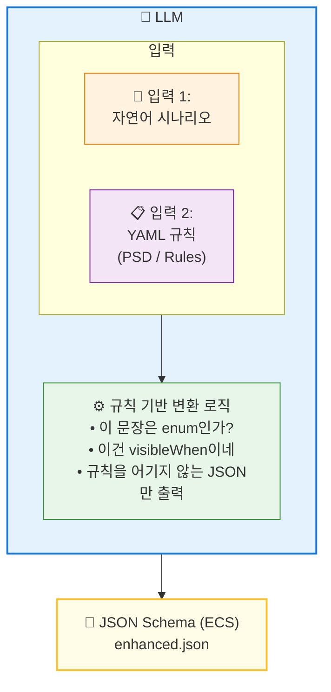

# LLM 기반 스키마 자동 생성 계획

> 기존 API 개발 방식의 한계를 극복하고, YAML 규칙 시스템을 활용하여 자연어 기반으로 API 스키마를 자동 생성하는 프로세스

---

## 핵심 아키텍처

> [!IMPORTANT]
> **YAML은 중간 산출물이 아니다.**  
> **YAML은 LLM의 "참조 규칙 집합 (Constraint / Policy)"이다.**
┌─────────────────────────────────────────────────────────────┐
│                         LLM                                 │
│  ┌─────────────────┐    ┌─────────────────────────────┐    │
│  │ 입력 1:         │    │ 입력 2:                      │    │
│  │ 자연어 시나리오  │ +  │ YAML 규칙 (PSD / Rules)     │    │
│  └────────┬────────┘    └──────────────┬──────────────┘    │
│           │                            │                    │
│           └──────────┬─────────────────┘                    │
│                      ▼                                      │
│            [규칙 기반 변환 로직]                             │
│            - "이 문장은 enum인가?"                          │
│            - "이건 visibleWhen이네"                         │
│            - "규칙을 어기지 않는 JSON만 출력"                │
└──────────────────────┬──────────────────────────────────────┘
                       ▼
            ┌─────────────────────┐
            │ JSON Schema (ECS)   │
            │ enhanced.json       │
            └─────────────────────┘ 


**비유:**
- `YAML` = 컴파일러의 **문법 정의**
- `JSON` = **컴파일 결과물**

---

## 실제 예시: Structure Type 다이얼로그

### 입력 1: 자연어 시나리오 (기획자 작성)

```markdown
## Structure Type 다이얼로그

### 1. Structure Type 선택
- 라디오 버튼 그룹에서 다음 중 하나를 선택한다:
  - 3-D (기본값), X-Z Plane, Y-Z Plane, X-Y Plane, Constraint RZ

### 2. Mass Control Parameter
- "Lumped Mass" 또는 "Consistent Mass" 중 하나를 선택

### 3. Convert Self-weight into Masses (조건부 필드)
- 체크박스로 활성화할 수 있다
- **이 옵션이 활성화되면** "Convert to X,Y,Z / X,Y / Z" 라디오 버튼이 표시된다
- **비활성화되면** 해당 옵션은 숨김 처리된다

### 4. 수치 입력
- Gravity Acceleration: 숫자, 기본값 9.806 m/sec²
- Initial Temperature: 숫자, 기본값 0 [C]
```

### 입력 2: LLM에 주입된 YAML 규칙

```yaml
uiRules:
  - when:
      type: boolean
    then:
      canHave:
        visibleWhen: true

requiredRules:
  - when:
      visibleWhen: exists
    then:
      mustDefine: x-required-when

enumRules:
  - when:
      description: contains "중 하나를 선택"
    then:
      mustHave: enum, x-enum-labels
```

### LLM 출력: JSON Schema (enhanced.json)

```json
{
  "STYP": {
    "type": "object",
    "properties": {
      "STYP": {
        "type": "integer",
        "description": "Structure type",
        "enum": [0, 1, 2, 3, 4],
        "x-enum-labels": {
          "0": "3-D",
          "1": "X-Z Plane",
          "2": "Y-Z Plane",
          "3": "X-Y Plane",
          "4": "Constraint RZ"
        }
      },
      "bSELFWEIGHT": {
        "type": "boolean",
        "description": "Convert self-weight into masses",
        "default": false
      },
      "SMASS": {
        "type": "integer",
        "enum": [1, 2, 3],
        "x-enum-labels": {
          "1": "Convert to X, Y, Z",
          "2": "Convert to X, Y",
          "3": "Convert to Z"
        },
        "x-ui": {
          "visibleWhen": { "bSELFWEIGHT": true }
        },
        "x-required-when": { "bSELFWEIGHT": true }
      },
      "GRAV": {
        "type": "number",
        "description": "Gravity acceleration (m/sec²)",
        "default": 9.806
      },
      "TEMP": {
        "type": "number",
        "description": "Initial temperature (°C)",
        "default": 0
      }
    }
  }
}
```

> [!NOTE]
> **YAML은 출력에 나타나지 않는다.**  
> **하지만 출력을 강제한다.**

---

## 자연어 → 스키마 변환 규칙

| 자연어 표현 | YAML 규칙 적용 | JSON 스키마 매핑 |
|------------|---------------|-----------------|
| "~중 하나를 선택한다" | `enumRules` | `enum` + `x-enum-labels` |
| "이 옵션이 활성화되면 ~가 표시된다" | `uiRules.visibleWhen` | `x-ui.visibleWhen` |
| "활성화되면 필수 입력" | `requiredRules` | `x-required-when` |
| "기본값은 ~이다" | - | `default` |
| "숫자를 입력한다" | - | `type: number` |
| "체크박스로 활성화" | - | `type: boolean` |

---

## 1. 개요 및 배경

### 1.1 현재 API 개발의 문제점


현재 API 개발 방식은 스키마 정의, 문서화, 실제 동작 검증이 분리되어 있어 다음과 같은 문제가 발생합니다:

검증 불가: 정의된 스키마가 실제 API 동작과 일치하는지 사전에 확인할 수 없습니다.

불일치 발생: 스키마, 문서, 실제 API 동작 간의 불일치로 인해 테스트 누락 및 런타임 오류가 발생합니다.

유지보수 비용 증가: API 변경 시마다 문서를 수동으로 수정해야 하므로 시간이 많이 소요되고 오류가 발생하기 쉽습니다.

신뢰성 저하: 검증 히스토리를 추적할 수 없어 변경에 따른 안정성을 보장하기 어렵습니다.


1.2 목표: Schema-Driven Development

우리의 목표는 스키마를 모든 것의 원천(Source of Truth)으로 만드는 것입니다.

단일 스키마 활용: 생성된 JSON Schema 파일 하나로 유효성 검증, UI 자동 생성, 문서화, 테스트 시나리오 생성을 모두 수행합니다.

사전 검증: 스키마를 통해 가능한 모든 입력 조합을 생성하고 실행하여 계약 위반을 사전에 차단합니다.

자동화: 자연어로 기술된 제품 사용 흐름을 LLM이 분석하여 올바른 스키마 구조를 자동으로 생성함으로써 기획 속도를 높입니다.


2. 자연어 기반 기획 프로세스

이 프로세스는 기획자가 UI 동작과 입력 흐름을 자연어로 기술하면, 시스템(LLM)이 이를 분석하여 표준화된 YAML 스키마(PSD, ECS)로 변환하는 과정을 거칩니다.

2.1 프로세스 단계

Step 1: 자연어 시나리오 작성 기획자는 제품의 사용 흐름을 다음과 같이 자연어로 상세하게 기술합니다.

UI 구성: "사용자는 '요소 생성' 폼에서 '타입' 드롭다운을 본다."

조건부 동작: "'타입'이 'BEAM'이면 '단면 번호' 입력 필드가 활성화되고, 'SOLID'면 비활성화된다."

입력 제약: "'인장력' 필드는 음수만 입력 가능하다."

단계별 조작: "Step 1에서 타입을 선택하고, Step 2에서 재료 번호를 입력한 후 제출한다."

### 2.2 개선된 엔드포인트 스키마 작성 원칙

LLM이 ECS(Endpoint Contract Schema)를 생성할 때 반드시 따라야 하는 규칙 집합입니다.
모든 규칙의 근거는 `schema_definitions/civil_gen_definition/enhanced/shared.yaml` (SSOT)입니다.

---

#### 기본값(Default) 규칙

> **근거 없이 추측하여 넣지 않는다. 다이얼로그 사양서 또는 API 응답 예시에서 명시된 기본값만 기입한다.**

| 타입 | 기본값 작성 조건 | 예시 |
|------|-----------------|------|
| `boolean` | 항상 `"default": false` 기입 (미체크가 기본 상태) | `"T_bLMT": { "type": "boolean", "default": false }` |
| `number` / `integer` | 사양서에 `0`이 기본값으로 명시된 경우에만 기입 | `"ANGLE": { "type": "number", "default": 0 }` |
| `string` | 기본값이 문서에 명확히 명시된 경우에만 기입 | 거의 없음 |

- 문자열 필드에 빈 값(`""`) 자동 할당 **금지**
- 숫자 `0` 이라도 사양서 근거 없이 넣는 것 **금지** — 아래 예시처럼 사양서에 "기본값 0" 또는 프로그램 초기값이 0임이 확인된 경우에만 허용

**ELEM 스키마 실제 적용 예 (기존 스키마 대비 추가된 기본값)**

```json
// 기존 스키마 (기본값 없음)
"ANGLE": { "description": "ELEMENTANGLE", "type": "number" }

// 개선된 스키마 — 베타각은 입력 안 하면 0이 기본임을 사양서에서 확인
"ANGLE": {
  "type": "number",
  "description": "ELEMENTANGLE",
  "default": 0,
  "x-ui": { "label": "Beta Angle" }
}

// boolean — 항상 false
"T_bLMT": {
  "type": "boolean",
  "description": "USETENSLIMIT?",
  "default": false,
  "x-ui": { "label": "Use Force Limit" },
  "x-optional-when": { "TYPE": "TENSTR" }
}

// ❌ 잘못된 예 — 근거 없이 문자열 기본값 추측 삽입
"FRAMEX": {
  "type": "string",
  "default": "Braced Non-sway"   // 사양서에 없는 추측값
}
```

**기존 ELEM 스키마 대비 개선된 항목 요약**

| 항목 | 기존 스키마 | 개선된 스키마 |
|------|-----------|-------------|
| TYPE 필드 | `"type": "string"` (열거 없음) | `enum: ["BEAM","TRUSS","TENSTR",...]` 명시 |
| NODE 배열 제약 | `items.maxItems: 8` (고정) | `allOf[].if(TYPE).then.properties.NODE.minItems/maxItems` (TYPE별 분리) |
| STYPE enum 제약 | 없음 | `allOf[].if(TYPE).then.properties.STYPE.enum` (TYPE별 허용값 분리) |
| 기본값 | 없음 | `ANGLE=0`, `NON_LEN=0`, `TENS=0`, `T_LIMIT=0`, `T_bLMT=false`, `W_TYPE=0` 추가 |
| 필드 표시명 | 없음 | 전 필드 `x-ui.label` 추가 |
| 서브타입 레이블 | 없음 | `x-enum-labels-by-type` (TYPE별 STYPE 이름 매핑) 추가 |
| 조건부 필드 표시 | 없음 | `x-optional-when` (NON_LEN, TENS, T_LIMIT, WALL 등) 추가 |
| 추가 속성 차단 | 없음 | `additionalProperties: false` 추가 |

---

#### 필수값(Required) 규칙

> **명시적으로 "필수"라고 된 것만 `required` 배열에 기입한다. optional이 기본값 원칙.**

- 예제 데이터(OpenAPI example)에 값이 존재한다고 해서 자동으로 필수로 간주하지 않는다.
- API 명세 또는 다이얼로그 사양서에서 명백히 "필수 입력"으로 표시된 항목만 기입한다.
- 아무 조건도 없는 경우 해당 객체의 `required` 배열은 비워 두거나 생략한다.

```json
// ✅ 올바른 예 — 최상위 래퍼만 필수, 내부 필드는 조건 없이 전부 Optional
{
  "required": ["Assign"],
  "properties": {
    "Assign": {
      "patternProperties": {
        "^[0-9]+$": {
          "properties": {
            "FRAMEX": { "type": "string" },
            "DT":     { "type": "string" }
          }
          // required 배열 없음 → 모두 optional
        }
      }
    }
  }
}
```

---

#### 조건부 필수(Conditional Required) 규칙

> **검증 로직은 반드시 `allOf + if/then` 표준 JSON Schema 구문으로 작성한다.  
> `x-required-when`은 UI 표시 전용이며, 검증을 대체하지 않는다.**

- 단순 boolean 플래그: `if: { properties: { FLAG: { const: true } } }` → `then: { required: ["FIELD"] }`
- enum 선택값: `if: { properties: { TYPE: { const: "XZ" } } }` → `then: { required: ["FRAMEX"] }`
- UI에서 조건부 필수임을 표시하려면 `x-required-when`을 **함께** 추가한다.
- UI에서 조건부로 보여줄 필드(검증은 불필요)는 `x-optional-when`만 사용한다.

**실제 적용 예 — DCTL `/DB/DCTL`**

DCTL 엔티티는 `DT`(Design Type) 값에 따라 방향별 Frame 설정 필드의 필수 여부가 달라진다:

| DT 값 | FRAMEX 필수 | FRAMEY 필수 | 이유 |
|-------|:-----------:|:-----------:|------|
| `3D`  | ✅ | ✅ | 3차원 해석 → X·Y 방향 모두 필요 |
| `XZ`  | ✅ | ❌ | X-Z 평면 → X 방향만 의미 있음 |
| `YZ`  | ❌ | ✅ | Y-Z 평면 → Y 방향만 의미 있음 |
| `XY`  | ❌ | ❌ | X-Y 평면 → 수평 해석, 방향 불필요 |

```json
// allOf + if/then → 검증 로직 (JSON Schema 표준)
"allOf": [
  {
    "if": { "properties": { "DT": { "const": "3D" } }, "required": ["DT"] },
    "then": { "required": ["FRAMEX", "FRAMEY"] }
  },
  {
    "if": { "properties": { "DT": { "const": "XZ" } }, "required": ["DT"] },
    "then": { "required": ["FRAMEX"] }
  },
  {
    "if": { "properties": { "DT": { "const": "YZ" } }, "required": ["DT"] },
    "then": { "required": ["FRAMEY"] }
  }
],

// x-required-when → UI 표시 전용 (검증과 별개)
"FRAMEX": {
  "type": "string",
  "x-required-when": { "DT": "3D" }
}
```

---

#### 확장 메타데이터(x-*) 지원 목록

`x-*` 키는 **순수 UI 마커(pureUI: true)** 원칙을 따른다. 삭제해도 JSON Schema 검증 동작은 100% 동일하게 유지된다. 검증 로직은 반드시 표준 JSON Schema 키워드(`allOf`, `if/then`, `required`, `enum`)로 작성한다.

##### 현재 지원 키 (`shared.yaml` markerRegistry 기준)

| 키 | 적용 위치 | 값 형식 | 역할 |
|----|----------|---------|------|
| `x-ui` | 필드, 객체 | object | 아래 세부 속성 참조 |
| `x-enum-labels` | 필드 | `{value: label}` 또는 string[] | `enum` 값에 대응하는 표시 라벨. `oneOf[].const + title` 방식이 우선, 보조 수단으로 사용 |
| `x-enum-labels-by-type` | 필드 | `{TYPE: {value: label}}` | `TYPE` 필드 값에 따라 동적으로 다른 enum 라벨 표시 |
| `x-required-when` | 필드 | object 또는 array | 조건 만족 시 UI에서 필수(Required) 표시. 검증은 `allOf`에서 처리 |
| `x-optional-when` | 필드 | object 또는 array | 조건 만족 시 UI에서 필드 표시. 검증과 무관 |
| `x-exclusive-keys` | 필드 | array | 상호 배타적 키 목록 (하나만 선택 가능 구조 표시) |

**`x-ui` 세부 속성**

| 속성 | 타입 | 적용 위치 | 역할 |
|------|------|----------|------|
| `label` | string | 필드 | Table(Spec) 탭의 Description 컬럼과 Builder 탭 입력 폼에서 표시되는 사람 읽는 필드명. 없으면 JSON 키 이름(`key`)을 그대로 사용. |
| `hint` | string | 필드 | `label` 아래에 작은 글씨(amber 색상 💡 아이콘)로 표시되는 보조 설명. 입력 단위, 주의사항 등을 전달할 때 사용. |
| `component` | string | 필드 | Builder 탭 입력 폼에서 사용할 UI 컴포넌트 힌트. `shared.yaml`의 `componentRegistry`를 기본으로 하되, 이 값으로 오버라이드 가능. `RadioGroup`으로 지정하면 Select 대신 라디오 버튼 그룹으로 렌더됨. |
| `order` | number | 필드 | MCP가 JSON 스키마를 저장할 때 같은 객체 내 필드의 출력 순서를 결정. 숫자가 작을수록 먼저 출력. `deterministic-json.ts`에서 `x-ui.order` 기준으로 정렬하여 결정론적 출력을 보장함. |

> **`groupId` / `groups` 는 스펙 탭 테이블 렌더러에서 읽히지 않으므로 신규 스키마에 작성하지 않는다.** 섹션 구분이 필요하면 `x-ui.group` (schemaLogicEngine 참조) 를 사용할 것.

> **`component` 허용값** (`shared.yaml` componentRegistry 기준)
> - `Input` — 텍스트/숫자 입력 (string, number, integer 기본값)
> - `Checkbox` — 체크박스 (boolean 기본값)
> - `Select` — 드롭다운 (enum 기본값)
> - `RadioGroup` — 라디오 버튼 그룹 (enum을 가로로 나열할 때)
> - `Textarea` — 멀티라인 입력 (array, object 기본값)

##### Deprecated 키 (사용 금지, 마이그레이션 필요)

| deprecated 키 | 대체 방법 |
|---------------|---------|
| `x-transport` | 공식 미지원 — 스키마에 기입하지 않는다 |
| `x-required-by-type` | `allOf[].if.then.required` |
| `x-enum-by-type` | `allOf[].if.then.properties.*.enum` + `x-enum-labels-by-type` |
| `x-node-count-by-type` | `allOf[].if.then.properties.NODE.minItems/maxItems` |
| `x-value-constraint` | `allOf[].if.then` + 필드 `description` |
| `x-uiRules.visibleWhen` | `x-optional-when` (MCP에서 자동 변환) |
| `x-ui.visibleWhen` | `x-optional-when` (MCP에서 자동 변환) |

##### 실제 적용 예 — DCTL `/DB/DCTL`

```json
// x-ui + x-enum-labels — 필드 표시 정보
"DT": {
  "type": "string",
  "enum": ["3D", "XZ", "YZ", "XY"],
  "x-enum-labels": ["3-D", "X-Z Plane", "Y-Z Plane", "X-Y Plane"],
  "x-ui": { "component": "RadioGroup", "groupId": "DESIGN_TYPE", "label": "Design Type", "order": 3 }
}

// x-enum-labels-by-type — TYPE별로 다른 enum 라벨이 필요한 경우
"STYPE": {
  "type": "integer",
  "x-enum-labels-by-type": {
    "TENSTR": { "1": "Truss", "2": "Hook", "3": "Cable" },
    "COMPTR": { "1": "Truss", "2": "Gap" }
  }
}

// x-required-when — UI 조건부 필수 표시 (검증은 allOf에서)
"FRAMEX": {
  "type": "string",
  "x-ui": { "label": "X-Direction of Frame", "groupId": "FRAME_DEF", "order": 1 },
  "x-required-when": { "DT": "3D" }
}

// x-optional-when — 조건부로만 보이는 필드 (검증 없음)
"SMASS": {
  "type": "integer",
  "x-optional-when": { "bSELFWT": true }
}
```

---

Step 2: LLM 기반 스키마 자동 생성 LLM은 사전 정의된 Product Schema Definition (PSD) 규칙과 Schema Validation Rules를 참조하여 자연어 시나리오를 분석합니다.

+1


분석: 자연어에서 엔티티(Entity), 필드(Field), 조건(Condition), 제약(Constraint)을 추출합니다.


매핑: 추출된 정보를 `x-ui`, `x-enum-labels`, `x-required-when`, `x-optional-when`, `x-transport` 등 현재 지원하는 확장 메타데이터에 매핑합니다. (deprecated된 `x-required-by-type`, `x-value-constraint` 등은 사용하지 않음)


생성: 표준화된 Endpoint Contract Schema (ECS) 구조의 초안을 생성합니다.

+1


Step 3: 스키마 검증 및 보정 생성된 스키마는 schema-validation-rules.yaml에 의해 자동으로 검증됩니다.


규칙 검사: 필수 필드 누락, 잘못된 타입 정의, 메타데이터 형식 오류 등을 확인합니다.

수정 제안: 오류가 발견되면 수정 제안을 제공하여 기획자가 빠르게 수정할 수 있도록 돕습니다.

Step 4: 결과물 자동 생성 확정된 스키마를 기반으로 다음 결과물들이 자동 생성됩니다.


UI 프로토타입: builder.yaml 규칙에 따라 입력 폼 UI가 렌더링되어 즉시 동작 확인 가능.


API 명세서: table.yaml 및 html-template.yaml을 활용하여 HTML 문서 자동 생성.


테스트 시나리오: 가능한 모든 입력 조합(Positive/Negative)에 대한 테스트 케이스 자동 생성.


3. 핵심 기술 요소

3.1 Product Schema Definition (PSD)

제품 전체의 공통 규칙과 구조를 정의한 YAML 파일입니다.


역할: 모든 엔드포인트가 따르는 최상위 기준.


구성: UI 매핑 규칙(ui-rules.yaml), 문서화 규칙(table.yaml), 스키마 검증 규칙(schema-validation-rules.yaml) 등을 포함합니다.


3.2 Endpoint Contract Schema (ECS)

특정 API 엔드포인트의 구체적인 입출력 계약을 정의한 JSON Schema입니다.

+1


특징: PSD를 참조하여 필요한 부분만 구체화합니다.


확장 메타데이터: x-ui, x-required-by-type 등을 통해 동적인 UI 동작과 비즈니스 로직을 표현합니다.


3.3 LLM 프롬프트 엔지니어링

LLM이 자연어를 올바른 스키마로 변환하도록 돕는 핵심 기술입니다.

Context: PSD 및 ECS 구조에 대한 지식을 주입합니다.

Instruction: "자연어 시나리오를 분석하여 x-required-by-type 조건을 포함한 ECS 스키마를 생성하라"와 같은 명확한 지시를 내립니다.

4. 기대 효과

기획 속도 향상: 복잡한 스키마 문법을 몰라도 자연어로 기능 기획이 가능해집니다.

개발-기획 간극 해소: 기획 산출물이 곧바로 실행 가능한 스키마가 되어 커뮤니케이션 오류를 줄입니다.

품질 확보: 자동 생성된 테스트 시나리오를 통해 API의 모든 분기 처리를 사전에 검증할 수 있습니다.

문서 최신화: 스키마 변경 시 문서가 자동으로 업데이트되어 항상 최신 상태를 유지합니다.

이 프로세스를 통해 API 개발은 