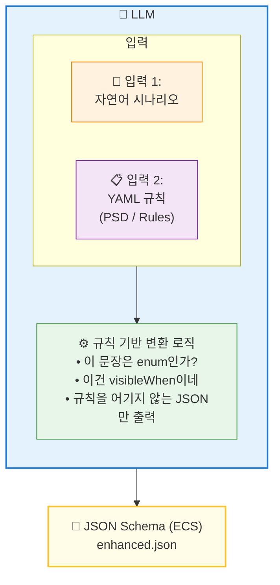

# LLM 기반 스키마 자동 생성 계획

> 기존 API 개발 방식의 한계를 극복하고, YAML 규칙 시스템을 활용하여 자연어 기반으로 API 스키마를 자동 생성하는 프로세스

---

## 핵심 아키텍처

> [!IMPORTANT]
> **YAML은 중간 산출물이 아니다.**  
> **YAML은 LLM의 "참조 규칙 집합 (Constraint / Policy)"이다.**
┌─────────────────────────────────────────────────────────────┐
│                         LLM                                 │
│  ┌─────────────────┐    ┌─────────────────────────────┐    │
│  │ 입력 1:         │    │ 입력 2:                      │    │
│  │ 자연어 시나리오  │ +  │ YAML 규칙 (PSD / Rules)     │    │
│  └────────┬────────┘    └──────────────┬──────────────┘    │
│           │                            │                    │
│           └──────────┬─────────────────┘                    │
│                      ▼                                      │
│            [규칙 기반 변환 로직]                             │
│            - "이 문장은 enum인가?"                          │
│            - "이건 visibleWhen이네"                         │
│            - "규칙을 어기지 않는 JSON만 출력"                │
└──────────────────────┬──────────────────────────────────────┘
                       ▼
            ┌─────────────────────┐
            │ JSON Schema (ECS)   │
            │ enhanced.json       │
            └─────────────────────┘ 


**비유:**
- `YAML` = 컴파일러의 **문법 정의**
- `JSON` = **컴파일 결과물**

---

## 실제 예시: Structure Type 다이얼로그

### 입력 1: 자연어 시나리오 (기획자 작성)

```markdown
## Structure Type 다이얼로그

### 1. Structure Type 선택
- 라디오 버튼 그룹에서 다음 중 하나를 선택한다:
  - 3-D (기본값), X-Z Plane, Y-Z Plane, X-Y Plane, Constraint RZ

### 2. Mass Control Parameter
- "Lumped Mass" 또는 "Consistent Mass" 중 하나를 선택

### 3. Convert Self-weight into Masses (조건부 필드)
- 체크박스로 활성화할 수 있다
- **이 옵션이 활성화되면** "Convert to X,Y,Z / X,Y / Z" 라디오 버튼이 표시된다
- **비활성화되면** 해당 옵션은 숨김 처리된다

### 4. 수치 입력
- Gravity Acceleration: 숫자, 기본값 9.806 m/sec²
- Initial Temperature: 숫자, 기본값 0 [C]
```

### 입력 2: LLM에 주입된 YAML 규칙

```yaml
uiRules:
  - when:
      type: boolean
    then:
      canHave:
        visibleWhen: true

requiredRules:
  - when:
      visibleWhen: exists
    then:
      mustDefine: x-required-when

enumRules:
  - when:
      description: contains "중 하나를 선택"
    then:
      mustHave: enum, x-enum-labels
```

### LLM 출력: JSON Schema (enhanced.json)

```json
{
  "STYP": {
    "type": "object",
    "properties": {
      "STYP": {
        "type": "integer",
        "description": "Structure type",
        "enum": [0, 1, 2, 3, 4],
        "x-enum-labels": {
          "0": "3-D",
          "1": "X-Z Plane",
          "2": "Y-Z Plane",
          "3": "X-Y Plane",
          "4": "Constraint RZ"
        }
      },
      "bSELFWEIGHT": {
        "type": "boolean",
        "description": "Convert self-weight into masses",
        "default": false
      },
      "SMASS": {
        "type": "integer",
        "enum": [1, 2, 3],
        "x-enum-labels": {
          "1": "Convert to X, Y, Z",
          "2": "Convert to X, Y",
          "3": "Convert to Z"
        },
        "x-ui": {
          "visibleWhen": { "bSELFWEIGHT": true }
        },
        "x-required-when": { "bSELFWEIGHT": true }
      },
      "GRAV": {
        "type": "number",
        "description": "Gravity acceleration (m/sec²)",
        "default": 9.806
      },
      "TEMP": {
        "type": "number",
        "description": "Initial temperature (°C)",
        "default": 0
      }
    }
  }
}
```

> [!NOTE]
> **YAML은 출력에 나타나지 않는다.**  
> **하지만 출력을 강제한다.**

---

## 자연어 → 스키마 변환 규칙

| 자연어 표현 | YAML 규칙 적용 | JSON 스키마 매핑 |
|------------|---------------|-----------------|
| "~중 하나를 선택한다" | `enumRules` | `enum` + `x-enum-labels` |
| "이 옵션이 활성화되면 ~가 표시된다" | `uiRules.visibleWhen` | `x-ui.visibleWhen` |
| "활성화되면 필수 입력" | `requiredRules` | `x-required-when` |
| "기본값은 ~이다" | - | `default` |
| "숫자를 입력한다" | - | `type: number` |
| "체크박스로 활성화" | - | `type: boolean` |

---

## 1. 개요 및 배경

### 1.1 현재 API 개발의 문제점


현재 API 개발 방식은 스키마 정의, 문서화, 실제 동작 검증이 분리되어 있어 다음과 같은 문제가 발생합니다:

검증 불가: 정의된 스키마가 실제 API 동작과 일치하는지 사전에 확인할 수 없습니다.

불일치 발생: 스키마, 문서, 실제 API 동작 간의 불일치로 인해 테스트 누락 및 런타임 오류가 발생합니다.

유지보수 비용 증가: API 변경 시마다 문서를 수동으로 수정해야 하므로 시간이 많이 소요되고 오류가 발생하기 쉽습니다.

신뢰성 저하: 검증 히스토리를 추적할 수 없어 변경에 따른 안정성을 보장하기 어렵습니다.


1.2 목표: Schema-Driven Development

우리의 목표는 스키마를 모든 것의 원천(Source of Truth)으로 만드는 것입니다.

단일 스키마 활용: 생성된 JSON Schema 파일 하나로 유효성 검증, UI 자동 생성, 문서화, 테스트 시나리오 생성을 모두 수행합니다.

사전 검증: 스키마를 통해 가능한 모든 입력 조합을 생성하고 실행하여 계약 위반을 사전에 차단합니다.

자동화: 자연어로 기술된 제품 사용 흐름을 LLM이 분석하여 올바른 스키마 구조를 자동으로 생성함으로써 기획 속도를 높입니다.


2. 자연어 기반 기획 프로세스

이 프로세스는 기획자가 UI 동작과 입력 흐름을 자연어로 기술하면, 시스템(LLM)이 이를 분석하여 표준화된 YAML 스키마(PSD, ECS)로 변환하는 과정을 거칩니다.

2.1 프로세스 단계

Step 1: 자연어 시나리오 작성 기획자는 제품의 사용 흐름을 다음과 같이 자연어로 상세하게 기술합니다.

UI 구성: "사용자는 '요소 생성' 폼에서 '타입' 드롭다운을 본다."

조건부 동작: "'타입'이 'BEAM'이면 '단면 번호' 입력 필드가 활성화되고, 'SOLID'면 비활성화된다."

입력 제약: "'인장력' 필드는 음수만 입력 가능하다."

단계별 조작: "Step 1에서 타입을 선택하고, Step 2에서 재료 번호를 입력한 후 제출한다."

Step 2: LLM 기반 스키마 자동 생성 LLM은 사전 정의된 Product Schema Definition (PSD) 규칙과 Schema Validation Rules를 참조하여 자연어 시나리오를 분석합니다.

+1


분석: 자연어에서 엔티티(Entity), 필드(Field), 조건(Condition), 제약(Constraint)을 추출합니다.


매핑: 추출된 정보를 x-ui, x-required-by-type, x-value-constraint 등의 확장 메타데이터에 매핑합니다.


생성: 표준화된 Endpoint Contract Schema (ECS) 구조의 초안을 생성합니다.

+1


Step 3: 스키마 검증 및 보정 생성된 스키마는 schema-validation-rules.yaml에 의해 자동으로 검증됩니다.


규칙 검사: 필수 필드 누락, 잘못된 타입 정의, 메타데이터 형식 오류 등을 확인합니다.

수정 제안: 오류가 발견되면 수정 제안을 제공하여 기획자가 빠르게 수정할 수 있도록 돕습니다.

Step 4: 결과물 자동 생성 확정된 스키마를 기반으로 다음 결과물들이 자동 생성됩니다.


UI 프로토타입: builder.yaml 규칙에 따라 입력 폼 UI가 렌더링되어 즉시 동작 확인 가능.


API 명세서: table.yaml 및 html-template.yaml을 활용하여 HTML 문서 자동 생성.


테스트 시나리오: 가능한 모든 입력 조합(Positive/Negative)에 대한 테스트 케이스 자동 생성.


3. 핵심 기술 요소

3.1 Product Schema Definition (PSD)

제품 전체의 공통 규칙과 구조를 정의한 YAML 파일입니다.


역할: 모든 엔드포인트가 따르는 최상위 기준.


구성: UI 매핑 규칙(ui-rules.yaml), 문서화 규칙(table.yaml), 스키마 검증 규칙(schema-validation-rules.yaml) 등을 포함합니다.


3.2 Endpoint Contract Schema (ECS)

특정 API 엔드포인트의 구체적인 입출력 계약을 정의한 JSON Schema입니다.

+1


특징: PSD를 참조하여 필요한 부분만 구체화합니다.


확장 메타데이터: x-ui, x-required-by-type 등을 통해 동적인 UI 동작과 비즈니스 로직을 표현합니다.


3.3 LLM 프롬프트 엔지니어링

LLM이 자연어를 올바른 스키마로 변환하도록 돕는 핵심 기술입니다.

Context: PSD 및 ECS 구조에 대한 지식을 주입합니다.

Instruction: "자연어 시나리오를 분석하여 x-required-by-type 조건을 포함한 ECS 스키마를 생성하라"와 같은 명확한 지시를 내립니다.

4. 기대 효과

기획 속도 향상: 복잡한 스키마 문법을 몰라도 자연어로 기능 기획이 가능해집니다.

개발-기획 간극 해소: 기획 산출물이 곧바로 실행 가능한 스키마가 되어 커뮤니케이션 오류를 줄입니다.

품질 확보: 자동 생성된 테스트 시나리오를 통해 API의 모든 분기 처리를 사전에 검증할 수 있습니다.

문서 최신화: 스키마 변경 시 문서가 자동으로 업데이트되어 항상 최신 상태를 유지합니다.

이 프로세스를 통해 API 개발은 