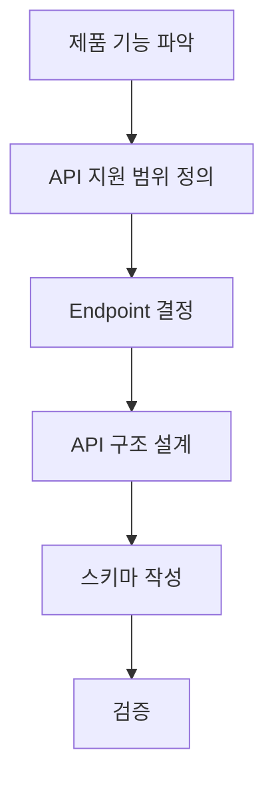

# API 기획 가이드

이 문서는 새 API를 처음 기획하는 사람이 기존 MIDAS API 형식에 맞게 Endpoint, Schema, Table, Manual, 검증 기준까지 한 번에 설계하기 위한 기준이다. 이 문서의 목표는 스키마 작성자와 개발자가 기획서를 보고 값을 추측하지 않아도 되는 상태를 만드는 것이다.

### API 기획의 흐름



| 순서 | 기획 단계 | 결정할 것 |
|---:|---|---|
| 1 | 제품 기능 파악 | CIVIL NX / GEN NX에서 사용자가 어떤 기능을 어떤 화면에서 수행하는지 |
| 2 | API 지원 범위 정의 | 조회/생성/수정/삭제/실행/결과 조회 중 무엇을 API로 제공할지 |
| 3 | Endpoint 결정 | 실제 호출 경로, Method, resource key, 설계 기준 segment |
| 4 | API 구조 설계 | Entity DB / Settings / Table / OPE/OPT / Document, `Assign`/`Argument`, collection/single |
| 5 | 스키마 작성 | Group/Object 구조, Field, 확장데이터, Table, Manual 기준 |
| 6 | 검증 | 구조, 값, UI, Table, Manual, API 호출 검증 항목 |

### 공통 작성 기준

| 항목 | 기준 |
|---|---|
| OpenAPI 버전 | OpenAPI 문서의 root에는 `"openapi": "3.1.0"`을 사용한다. |
| Schema 형식 | OpenAPI 3.1 기준의 JSON Schema 형식을 따른다. |
| 기존 정의 우선 | 기존 OpenAPI의 endpoint, method, field key, enum 값이 있으면 그대로 따른다. |

## 1. 제품 기능 파악

API 기획은 Endpoint부터 시작하지 않는다. 먼저 CIVIL NX / GEN NX 제품에서 사용자가 어떤 기능을 어떤 화면에서 수행하는지 파악해야 한다. 제품 기능을 모르면 API의 단위, 입력값, 결과값, 검증 기준이 모두 흔들린다.

| 확인 항목 | 작성 내용 | 예시 |
|---|---|---|
| Product | 대상 제품 | `CIVIL NX`, `GEN NX` |
| Module | 제품 내 대분류 | Design, Analysis, Result, DB |
| Menu Path | 사용자가 접근하는 메뉴 경로 | Design > PSC > Design Input |
| Function Name | 화면 또는 기능 이름 | Modify Material |
| User Task | 사용자가 실제로 하는 일 | material 설계 데이터를 조회/수정한다. |
| 기준 화면 | 기획 기준이 되는 화면 | dialog, table, property panel |
| 기존 자료 | 참고할 문서/데이터 | OpenAPI, Zendesk, 기존 DB key, 기존 schema |

### 1.1 UI 구조 파악

제품 화면의 UI 위계를 먼저 정리해야 object 구조, field group, section, field order, Manual 목차가 흔들리지 않는다. 화면의 묶음이 실제 payload 묶음인지, 단순 표시용 묶음인지 먼저 구분한다.

| UI 위계 | 파악할 내용 | 스키마/문서에 반영되는 곳 |
|---|---|---|
| 화면 | API가 담당하는 기준 화면 또는 dialog | API Name, Manual title |
| Tab | 화면 안의 탭 구분 | payload 구조면 object, 표시용이면 Manual section |
| Group/Section | 화면 안의 묶음 단위 | payload 묶음이면 object/array |
| Field | 실제 입력/선택/표시 항목 | schema `properties` |
| Table | column header, row 선택, component 선택 | Table API, `COMPONENTS` |
| Button/Command | 저장, 실행, 계산, import/export 같은 동작 | Method, OPE/OPT API 여부 |
| 반복 항목 | material list, section list, row list | collection/single 판단 |

### 1.2 동작 구조 파악

화면의 동작 위계를 정리해야 조건부 field, enabled/disabled 상태, required 조건을 schema에 반영할 수 있다.

| 동작 유형 | 파악할 내용 | 반영 방식 |
|---|---|---|
| checkbox 활성화 | 체크 시 어떤 field가 활성화/비활성화되는지 | 조건부 required, `x-ui` 표시 조건 |
| radio 선택 | 선택값별로 어떤 field나 option이 바뀌는지 | `allOf / if / then`, type별 enum |
| dropdown 선택 | code/type 선택에 따라 하위 option이 바뀌는지 | 조건부 enum, `x-enum-labels-by-type` |
| button 실행 | 버튼이 단순 UI인지 실제 API 동작인지 | 제외 또는 OPE/OPT API |
| row 선택 | 선택된 row가 payload 대상인지 단순 UI 상태인지 | collection ID, target field |
| 입력값 계산 | 한 field 값이 다른 field의 default/범위를 바꾸는지 | value constraint, 검증 조건 |

### 1.3 OPE/OPT 기능 파악

OPE는 operation functions를 의미한다. GUI에서 수행할 수 있는 제품 동작을 API로 제어하거나, pre-process 단계의 값을 확인하기 위한 기능을 포함한다. OPE는 일반적으로 제품 DB에 저장되는 데이터가 아니라 동작 실행, 상태 조회, 사전 계산값 확인, 생성/변환 결과 확인을 다룬다.

제품 DB에 단순 저장되는 API가 아니라 제품 동작을 수행하는 OPE API와 OPT 기능도 별도로 파악해야 한다. 제품 API 문서의 OPE category에는 Project Status, Divide Elements, Auto-Mesh Planar Area, Story Calc OPT 같은 기능이 포함될 수 있고, OpenAPI에는 `OPT`, `OPT_CHECK`, `CALC_OPT` 같은 option 계열 field/object가 존재할 수 있다.

여기서 OPE/OPT는 일반적인 “유틸”이라는 임의 분류가 아니라 제품 문서와 OpenAPI에 있는 실제 분류/명칭이다. 기획자는 OPT가 기능/API 이름인지, payload 안의 option field/object인지 구분해서 구조에 반영해야 한다.

| 구분 | 예시 | API 필요 여부 판단 | 구조 반영 |
|---|---|---|---|
| OPE 기능 API | Project Status, Divide Elements, Auto-Mesh Planar Area | 제품 동작/조회/생성을 API로 제공하는가 | OPE API로 분류, Method와 wrapper 확인 |
| OPT 기능 API | Story Calc OPT | 제품 옵션 계산/설정/실행 기능인가 | OPT 기능으로 분류, Method와 `Argument` 구조 확인 |
| OPT field/object | `OPT`, `OPT_CHECK`, `CALC_OPT`, `OPTION` | option 선택이나 활성화 여부를 payload로 보내는가 | 기존 key 유지, object/boolean/enum 구조 확인 |
| 계산 실행 | check, run, calculate | 사용자가 입력값을 보내고 결과/상태를 받는가 | OPE/OPT API, `Argument` |
| 자동 생성 | auto generate, wizard result | 제품이 데이터를 생성해 DB에 반영하는가 | OPE API 또는 `Assign` 후속 저장 |
| 변환/가공 | convert, merge, split | 입력 데이터를 다른 형식으로 바꾸는가 | OPE API, input/output schema |
| import/export | file import, report export | 경로, format, 대상 선택이 필요한가 | OPE API, path/format field |
| 검증/미리보기 | validate, preview | 저장 전 오류나 결과를 확인하는가 | OPE/OPT API, result/diagnostic response |
| 단순 화면 보조 | 접기/펼치기, 정렬, 검색 UI | 제품 데이터나 계산과 무관한가 | API 제외 |

| 질문 | 확인해야 하는 이유 |
|---|---|
| 이 기능은 값을 저장하는가, 계산을 실행하는가, 결과를 조회하는가? | API 유형을 결정한다. |
| 사용자가 여러 항목을 동시에 다루는가? | collection/single을 결정한다. |
| 화면에 table column header가 있는가? | Table API 여부를 결정한다. |
| 제품 DB에 이미 존재하는 key가 있는가? | field key와 endpoint resource key를 결정한다. |
| 설계 기준이나 code별로 option이 달라지는가? | 조건부 enum과 확장데이터가 필요하다. |
| 화면 group/section 안에 어떤 field가 속하는가? | field order, group, Manual section을 결정한다. |
| 어떤 checkbox/radio/dropdown이 다른 field를 활성화/비활성화하는가? | 조건부 required와 UI 표시 조건을 결정한다. |
| OPE 문서 또는 OPT 기능으로 제공되는 동작인가? | OPE/OPT API 필요 여부를 결정한다. |
| `OPT`, `OPT_CHECK`, `CALC_OPT`, `OPTION` 같은 option field/object가 있는가? | 기존 OpenAPI key와 option 구조를 schema에 반영한다. |

## 2. API 지원 범위 정의

제품 기능을 파악한 뒤에는 API가 그 기능 중 어디까지 지원할지 정한다. 한 화면에 있는 모든 UI 동작이 API가 되는 것은 아니다. API는 저장, 조회, 실행, 결과 조회처럼 제품 데이터나 계산과 연결되는 동작을 대상으로 한다.

| 지원 범위 | 주 Method | 판단 기준 | 기획서에 적을 내용 |
|---|---|---|---|
| 조회 | `GET` | 기존 데이터나 설정을 읽는다. | 조회 대상, response 구조 |
| 생성 | `POST` | 새 entity 또는 새 실행 요청을 만든다. | 생성 단위, required field |
| 수정 | `PUT` | 기존 entity 또는 설정을 변경한다. | 수정 단위, 기존 값 유지/덮어쓰기 |
| 삭제 | `DELETE` | 기존 entity를 삭제한다. | 삭제 대상 key, 다중 삭제 여부 |
| 실행 | `POST` | 계산, 변환, export 같은 동작을 실행한다. | 실행 인자, 성공/실패 조건 |
| OPE/OPT | 제품 문서 기준 확인 | DB 저장보다 제품 동작, 옵션 계산, 상태 조회, 자동 생성, import/export가 목적이다. | Method, input argument, output/result, side effect 여부 |
| 상태/단순 결과 조회 | `GET` 우선, 제품 문서 기준 확인 | 별도 request body 없이 현재 상태나 계산 결과를 읽는다. | 조회 대상, response 구조 |
| Result Table 조회 | `POST` 우선, 제품 문서 기준 확인 | `TABLE_TYPE`, `COMPONENTS`, filter, unit, load case 같은 조회 조건을 body로 보낸다. | table type, filter, component |

| 포함할 것 | 제외할 것 |
|---|---|
| 제품 데이터로 저장되는 값 | OK, Cancel, Help, Close 같은 실행 버튼 |
| 계산에 사용되는 입력값 | 화면 정렬, 접기/펼치기, 탭 전환 |
| 결과 table의 column/row 선택값 | 단순 label, header, separator |
| export 경로, 단위, 대상 선택값 | 검색어가 payload에 저장되지 않는 단순 필터 |
| DB에 저장되지 않아도 실행 결과나 side effect가 있는 OPE/OPT 기능 | 제품 동작과 무관한 단순 화면 편의 기능 |

## 3. Endpoint 결정

Endpoint는 화면 이름을 영어로 길게 번역해서 새로 만드는 값이 아니다. 제품 API, OpenAPI, 기존 DB key, 기존 Zendesk 문서가 있으면 그 경로와 key를 우선한다.

### 3.1 Endpoint 구성 요소

| 항목 | 작성 기준 | 예시 |
|---|---|---|
| Product | 제품 또는 프로젝트 이름을 그대로 쓴다. | `civil-nx-mec` |
| Root Segment | API 대분류를 쓴다. | `/db`, `/DESIGN`, `/post`, `/doc` |
| Domain Segment | 설계 분야, 기능 영역, result 영역을 쓴다. | `PSC`, `RC`, `TABLE` |
| Code Segment | 설계 기준 또는 버전을 제품 표기 그대로 쓴다. | `AASHTO-LRFD24`, `KDS41` |
| Resource Key | 기존 API resource key를 우선한다. | `MATD`, `STYP`, `ELEM` |
| Method | 실제 지원 method만 쓴다. | `GET`, `POST`, `PUT`, `DELETE` |
| API Name | 사람이 읽는 기능 이름을 쓴다. | `Modify Material` |

Endpoint path segment에는 `_`를 사용하지 않는다. 단어 구분이 필요하면 `-`를 사용한다. 이 규칙은 Endpoint 경로에 대한 규칙이며, OpenAPI field key의 `_`는 기존 key를 그대로 유지한다.

#### DESIGN Endpoint segment 예시

Endpoint segment는 `/`로 나뉘는 경로 단위다. `/DESIGN/PSC/AASHTO-LRFD24/TABLE`은 다음처럼 읽는다.

| Segment | 값 | 의미 | 기획자가 확인할 것 |
|---:|---|---|---|
| 1 | `DESIGN` | 설계 기능 계열 | 기존 API에서 `DESIGN` 계열로 제공되는지 확인한다. |
| 2 | `PSC` | 설계 분야 또는 제품 모듈 | 제품/API 표기를 그대로 쓴다. 화면명을 임의로 번역하지 않는다. |
| 3 | `AASHTO-LRFD24` | 설계 기준 또는 기준 버전 | `AASHTO`처럼 줄이지 않고 실제 endpoint segment를 그대로 쓴다. |
| 4 | `TABLE` | 대상 resource 또는 기능 key | `MATD`, `TABLE`처럼 기존 API key를 그대로 쓴다. |

Code segment는 의미를 설명하는 이름이 아니라 실제 endpoint에 들어가는 값이다. 제품/API가 `/AASHTO-LRFD24/`를 쓰면 기획서에도 `/AASHTO-LRFD24/`를 그대로 적는다.

### 3.2 Endpoint 계열별 기본 규칙

| Endpoint 계열 | 주 용도 | 기본 wrapper | 기본 entity type | 예시 |
|---|---|---|---|---|
| `/db/{RESOURCE}` | DB entity 생성/수정/조회 | `Assign` | collection | `/db/MATD` |
| `/DESIGN/{DOMAIN}/{CODE}/{RESOURCE}` | 설계 기준별 입력/설정 | `Assign` 우선, 필요 시 확인 | collection 우선 | `/DESIGN/PSC/AASHTO-LRFD24/MATD`, `/DESIGN/PSC/AASHTO-LRFD24/TABLE` |
| `/post/TABLE` | 결과 table 조회/표시 | `Argument` | single | `/post/TABLE` |
| `/post/{ACTION}` | 계산, 조회, 실행 인자 | `Argument` | single | `/post/BEAMFORCE` |
| `/doc/{ACTION}` | 문서/리포트/실행 계열 | `Argument` | single | `/doc/...` |
| 기타 | 기존 API 확인 필요 | 확인 필요 | 확인 필요 | 기존 문서 기준 |

### 3.3 Endpoint 작명 판단

| 상황 | 결정 기준 | 잘못된 방향 | 올바른 방향 |
|---|---|---|---|
| 화면명이 `Modify Material`이다. | Endpoint 이름은 화면 이름이나 `create/update`가 아니라 실제 데이터 이름으로 정한다. | `/DESIGN/.../modify-material` | `/DESIGN/.../MATD` |
| 기존 `/db/MATD`가 있다. | resource key는 기존 DB key를 우선한다. | `/DESIGN/.../MATERIAL` | `/DESIGN/.../MATD` |
| 설계 기준이 API 경로에 들어간다. | code segment는 제품 표기를 그대로 쓴다. | `/DESIGN/PSC/AASHTO/MATD` | `/DESIGN/PSC/AASHTO-LRFD24/MATD` |
| Endpoint segment에 단어 구분이 필요하다. | `_`를 쓰지 않고 `-`를 쓴다. | `/story_calc_opt` | `/story-calc-opt` |
| Method가 여러 개다. | Endpoint는 같고 Method만 분리한다. | `/matd-create`, `/matd-update` | `POST/PUT /DESIGN/.../MATD` |
| schema 저장용 이름이 필요하다. | 파일명/schema title은 endpoint와 별도로 관리한다. | endpoint를 파일명으로 그대로 사용 | `MATD`, `PSC_AASHTO_LRFD24_MATD` 등 규칙화 |

## 4. API 구조 설계

Endpoint를 결정한 뒤에는 request body가 어떤 구조인지 정한다. 대부분의 API는 `Assign collection` 또는 `Argument single` 중 하나지만, `STYP`처럼 `Assign` wrapper와 `"1"` key를 쓰면서도 실제로는 한 개 데이터만 지원하는 `Assign fixed single` 유형도 있다.

### 4.1 API 유형

| API 유형 | 설명 | 주로 쓰는 wrapper | entity type |
|---|---|---|---|
| Entity DB | material, section, node, element처럼 여러 ID를 가진 entity 저장 | `Assign` | collection |
| Settings | 설계 기준, 계산 옵션, code option 같은 설정 | `Assign` 또는 `Argument` 확인 | collection, single, fixed single 확인 |
| Assign fixed single | `STYP`처럼 `Assign` 아래 숫자 key를 쓰지만 `"1"`만 허용하는 단일 설정 | `Assign` | single, fixed key `"1"` |
| Table | 결과 table 표시 조건과 column 선택 | `Argument` | single |
| OPE/OPT | 계산, 실행, export, validate, preview, story calc option 같은 제품 동작/옵션 기능 | `Argument` 우선, 문서 확인 | single 우선 |
| Document | report/manual/doc 계열 실행 또는 조회 | `Argument` | single |

### 4.2 Assign collection 구조

```json
{
  "Assign": {
    "1": {
      "FIELD_A": "value",
      "FIELD_B": 10
    },
    "2": {
      "FIELD_A": "value",
      "FIELD_B": 20
    }
  }
}
```

| 항목 | 기준 |
|---|---|
| 사용 위치 | DB, Design, Material, Section, Node, Element, 설계 입력 entity |
| wrapper | `Assign` |
| entity type | collection |
| ID key | `"1"`, `"2"` 같은 문자열 key |
| field 표 범위 | `"1"` 내부의 단일 entity field만 설명 |
| 기획서에 쓰지 않는 것 | `Assign` 자체를 field 목록에 넣지 않는다. |

### 4.3 Assign fixed single 구조

```json
{
  "Assign": {
    "1": {
      "STYP": 0,
      "MASS": 0,
      "GRAV": 0.0
    }
  }
}
```

| 항목 | 기준 |
|---|---|
| 사용 위치 | `STYP` 같은 프로젝트/설계 설정, resource당 하나만 존재하는 입력 |
| wrapper | `Assign` |
| entity type | single, fixed key |
| ID key | `"1"`만 사용한다. `"2"` 이상 지원 여부는 실제 API 문서, 샘플, 동작으로 확인한다. |
| field 표 범위 | `"1"` 내부의 단일 설정 object field만 설명 |
| 기획서에 명시할 것 | `Assign fixed single` 또는 `Assign, fixed key "1" only` |
| 주의할 점 | `Assign` 아래 숫자 key가 있다고 해서 collection으로 확정하지 않는다. |

### 4.4 Argument single 구조

```json
{
  "Argument": {
    "TABLE_TYPE": "BEAMFORCE",
    "COMPONENTS": ["Force-x", "Moment-y"]
  }
}
```

| 항목 | 기준 |
|---|---|
| 사용 위치 | `/post`, `/doc`, table 조회, 계산 실행, 단발성 조회 조건 |
| wrapper | `Argument` |
| entity type | single |
| ID key | 없음 |
| field 표 범위 | `Argument` 내부 field만 설명 |
| 기획서에 쓰지 않는 것 | `Argument` 자체를 field 목록에 넣지 않는다. |

### 4.5 Endpoint와 transport의 분리

| 구분 | 의미 | 예시 |
|---|---|---|
| 제품 Endpoint | 사용자가 보는 실제 API 경로 | `/DESIGN/PSC/AASHTO-LRFD24/MATD` |
| Method | 실제 HTTP method | `GET`, `POST`, `PUT`, `DELETE` |
| Body Root | request body wrapper | `Assign` |
| Field 표 범위 | 기획서에서 상세 field로 설명할 대상 | `"1"` 내부 field |
| JSON Schema 범위 | 실제 request 검증 schema가 포함할 구조 | `Assign`, `"1"` key 패턴, 내부 field |

## 5. 스키마 작성

스키마 작성은 field만 쓰는 작업이 아니다. Group/Object 구조, Field 정의, 확장데이터, Table 기준, Manual 기준을 한 챕터 안에서 같이 정리해야 Builder, Runner, Manual, API 호출이 같은 구조를 바라본다.

### 5.1 스키마 작성 범위

스키마 작성 범위는 산출물별로 다르게 본다. 핵심은 `JSON Schema`에는 API body 전체를 쓰고, `기획 field 표`에는 사용자가 입력하거나 제품이 저장하는 업무 field만 쓴다는 점이다.

#### 범위 구분

| 산출물 | 작성 범위 | 작성하지 않는 것 |
|---|---|---|
| JSON Schema 파일 | API가 실제 받는 body 전체 | 없음 |
| 기획 field 표 | 실제 업무 field와 그 설명 | `Assign`, `Argument`, `"1"` 같은 전송 구조 |
| Manual request 예제 | 사용자가 그대로 호출할 수 있는 body 전체 | 없음 |

#### 구조별 작성 기준

| API 구조 | JSON Schema 파일에 작성 | 기획 field 표에 작성 |
|---|---|---|
| `Assign collection` | `Assign` → 숫자 ID key → entity field | entity field만 |
| `Assign fixed single` | `Assign` → `"1"` key만 허용 → 설정 field | 설정 field만 |
| `Argument single` | `Argument` → argument field | argument field만 |

#### 확인 기준

| 확인할 것 | 확인 기준 |
|---|---|
| body가 `Assign`으로 시작하는가 | `Assign collection` 또는 `Assign fixed single`로 본다. |
| `Assign` 아래 ID key가 여러 개 가능한가 | 여러 개 가능하면 collection, `"1"`만 가능하면 fixed single이다. |
| body가 `Argument`로 시작하는가 | `Argument single`로 본다. |
| 어떤 field가 필수인가 | `Assign`/`Argument` 안쪽의 실제 업무 field 기준으로 판단한다. |
| wrapper도 schema에 넣는가 | JSON Schema에는 넣고, 기획 field 표에는 넣지 않는다. |

#### 주의 기준

| 주의할 점 | 기준 |
|---|---|
| wrapper 누락 금지 | 실제 request가 `Assign` 또는 `Argument`로 시작하면 JSON Schema에도 포함한다. |
| wrapper field 오인 금지 | `Assign`, `Argument`, `"1"`은 기획 field 표에서 업무 field로 세지 않는다. |
| fixed single 확인 | 하나만 받는 API인지, 반드시 `"1"`만 받는 API인지 구분한다. |
| 필수값 구분 | wrapper가 필요한지와 내부 업무 field가 필요한지는 따로 판단한다. |

### 5.2 Group/Section 구조 설계

화면의 Group/Section은 먼저 데이터 구조인지 판단한다. 실제 payload에서 함께 묶여야 하는 값이면 `object` 또는 `array`로 설계하고, 단순히 화면에서 보기 좋게 나뉜 묶음이면 표시용 메타데이터나 Manual section으로만 처리한다.

| 화면 묶음 유형 | 판단 기준 | schema 반영 |
|---|---|---|
| 데이터 묶음 | payload가 하위 객체로 묶여야 한다. | `type: object` |
| 반복 묶음 | 같은 구조가 여러 번 반복된다. | `type: array`, `items` 정의 |
| 선택 방식 묶음 | 여러 입력 방식 중 하나만 선택한다. | `object` + `oneOf` 또는 조건부 required |
| 조건부 묶음 | 특정 선택값에서만 묶음 전체가 필요하다. | object field + 조건부 required/visible |
| 표시용 묶음 | payload 구조와 무관한 화면 정리용 group이다. | schema object를 만들지 않고 Manual/Builder 표시용 section으로만 처리 |
| 탭 구분 | 탭이 payload 구조를 의미하지 않는다. | 표시용 section으로만 처리 |

예시:

| 화면 구조 | 잘못된 처리 | 올바른 처리 |
|---|---|---|
| Material Data group 안에 `ANAL`, `DESIGN` 하위 값이 있다. | 모든 field를 최상위에 나열 | `DATA1.ANAL`, `DATA1.DESIGN` object로 묶음 |
| Target 선택에서 `KEYS`, `TO`, `STRUCTURE_GROUP_NAME` 중 하나만 쓴다. | 세 field를 독립 optional로만 둠 | `NODE_ELEMS` object + 상호 배타 조건 |
| 화면상 “General” 박스지만 payload는 최상위 field다. | 불필요한 `GENERAL` object 생성 | 최상위 field 유지, 표시용 group만 사용 |

### 5.3 Field 설계

| 항목 | 의미 | 필수 여부 | 작성 기준 |
|---|---|---|---|
| Order | 화면 또는 문서 표시 순서 | 필수 | 위에서 아래, 왼쪽에서 오른쪽 순서 |
| Field Key | API payload key | 필수 | 실제 request/response key 기준 |
| Label | 사용자에게 보일 이름 | 필수 | 화면 label 또는 Manual 표시명 |
| Type | JSON Schema type | 필수 | string, integer, number, boolean, array, object |
| Required | 필수 여부 | 필수 | Y, N, 조건부 |
| Default | 생략 시 기본값 | 확인 가능하면 필수 | 화면 기본값, 기존 API default |
| Enum/Options | 선택 가능한 값 | 선택형이면 필수 | value와 label을 분리 |
| Unit | 단위 | number면 확인 필요 | force, length, stress 등 |
| Condition | 사용 조건 | 조건부면 필수 | 조건 Field, 조건 값, 영향 Field |
| Description | API 의미 | 필수 | 계산 의미, 제약, 주의사항 |

#### Field naming

| 구분 | 작성 기준 | 비고 |
|---|---|---|
| 신규 key | `UPPER_SNAKE_CASE`를 기본으로 한다. | 사람이 의미를 읽을 수 있어야 한다. |
| 타입 정보 | `b`, `i`, `d`, `s` 같은 타입 접두어를 새 key에 붙이지 않는다. | 타입은 `Type` 항목에 따로 쓴다. |
| 기존 key | 기존 OpenAPI/Zendesk/제품 DB key가 있으면 철자와 대소문자를 그대로 따른다. | 호환성이 naming 규칙보다 우선이다. |
| 화면 label | 화면 label 문장을 그대로 긴 key로 만들지 않는다. | label은 Label 항목에 쓰고, key는 짧게 쓴다. |

#### 기존/공통 key 목록

아래 key는 기존 API에서 반복적으로 쓰는 대표 이름이다. 같은 의미의 값을 기획할 때 새 key를 만들지 말고 기존 key를 우선 확인한다. 모든 API에 공통으로 넣으라는 뜻은 아니며, 해당 기능이 있을 때만 사용한다. 이 표가 기존 key 전체 목록은 아니므로, 실제 기획 시에는 대상 endpoint의 OpenAPI 정의와 제품 API 문서를 다시 확인해야 한다.

| 구분 | 기존 key | 쓰는 경우 | 기획 시 확인할 것 | OpenAPI 사용 endpoint 예시 |
|---|---|---|---|---|
| Wrapper | `Assign` | ID 기반 entity를 생성/수정/조회하는 body root | 최종 JSON Schema에는 `properties.Assign`으로 포함하고, field 표에는 업무 field로 넣지 않는다. | `/DB/MATD`, `/DB/MATL`, `/DB/NODE` |
| Wrapper | `Argument` | 실행, 조회, Table, OPE/OPT처럼 단일 인자를 보내는 body root | 최종 JSON Schema에는 `properties.Argument`로 포함하고, field 표에는 업무 field로 넣지 않는다. | `/POST/TABLE`, `/POST/TEXT`, `/DOC/EXPORT`, `/OPE/AUTOMESH` |
| Entity 공통 | `TYPE` | entity 종류, 입력 방식, 조건 분기 | enum 전체 목록, `TYPE`별 required field | `/DB/MATD`, `/DB/MATL` |
| Entity 공통 | `NAME` | entity 이름 또는 표시 이름 | 필수 여부, 중복 허용 여부 | `/DB/MATD`, `/DB/MATL` |
| Entity 공통 | `DATA1`, `DATA2` | 상세 데이터 하위 묶음 | 하위 object 구조, `TYPE`별 구조 차이 | `/DB/MATD`, `/DB/MATD/{id}` |
| Entity 공통 | `CODE` | code 또는 기준값 선택 | enum인지 자유 입력인지, 제품 표기값 | `/DB/MATL`, `/DB/EPSE` |
| Section/Property | `SECT`, `SECT_NAME`, `SECTTYPE`, `SHAPE`, `SHAPE_TYPE`, `DB_NAME` | section/property/shape 선택 또는 참조 | section key인지 이름인지, DB section 참조인지 사용자 정의인지 | `/DB/SECT`, `/DB/SECV`, `/DB/ELEM`, `/OPE/SECT_NAME` |
| Material/물성 | `MATL`, `ELAST`, `POISSON`, `THERMAL`, `DENSITY` | material 참조와 물성값 | material key/name 구분, 단위, code material 여부 | `/DB/MATL`, `/DB/MATD`, `/DB/ELEM`, `/DB/BTMP` |
| 식별/설명 | `ID`, `NO`, `DESC` | ID, 번호, 설명/비고 | ID가 path id인지 payload field인지, 자동 생성 여부 | `/DB/BMLD`, `/DB/BTMP`, `/DB/CNLD`, `/DB/FBLA` |
| Group/Load | `GROUP_NAME`, `LCNAME` | group 이름, load case 이름 | 이름 목록 출처, 단일 string인지 array인지 | `/DB/ARPR`, `/DB/BMLD`, `/DB/BODF`, `/DB/BCCT` |
| Load 기본 | `LOAD`, `LOAD_TYPE`, `LOAD_NAME`, `LCTYPE`, `LOADCASE`, `LCNAME_ITEM` | load 종류, load 이름, load case 항목 | load type enum, 이름 참조 방식, case/list 구조 | `/DB/BUCK`, `/DB/EPSE`, `/DB/MVHL`, `/DB/GALD`, `/DB/THIS` |
| Load 방향/분포 | `LOAD_DIR`, `LOAD_DIST`, `UNIFORM_LOAD_DIST`, `UNIFORM_LOAD_W`, `LOAD_VALUE` | load 방향, 거리, 분포하중, 표시값 | 방향 enum, 거리/하중 단위, 값 object 구조 | `/DB/LLAN`, `/DB/MVHL`, `/DB/PNLA`, `/DB/MVLDJP`, `/VIEW/DISPLAY` |
| Load 항목 | `LOAD_ITEMS`, `LOAD_ITEMS2`, `SUB_LOAD_ITEMS`, `SUB_LOAD_DATAS`, `LOAD_NUM_ITEMS` | load item 목록 또는 하위 load 데이터 | array item 구조, item 개수 field와의 관계 | `/DB/MVHL`, `/DB/MVLD`, `/DB/MVLDCH`, `/DB/MVLDID`, `/DB/MVLDJP` |
| Load 조합 | `nLCOMTYPE`, `vCOMB`, `COMB_OPTION`, `COMB_LIST`, `bUSECOMB`, `OPT_COMB` | load combination type, combination list/option | 기존 prefix key 유지, 조합 type enum, list item 구조 | `/DB/LCOM-CONC`, `/DB/LCOM-GEN`, `/DB/EFCT`, `/DB/MVLD`, `/DB/MVLDEU` |
| Moving Load | `VEHICLE_LOAD_NAME`, `VEHICLE_LOAD_NUM`, `VEHICLE_TYPE`, `VEHICLE_NAME`, `PERMIT_LOAD`, `NUM_LOADED_LANES` | vehicle/moving load 관련 입력 | 차량 이름 목록, lane 수, permit load 여부 | `/DB/MVHL`, `/DB/MVLD`, `/DB/MVLDPL`, `/DB/MVLDID` |
| Load 표시 flag | `NODAL_LOAD`, `BEAM_LOAD`, `FLOOR_LOAD`, `PRESSURE_LOAD`, `PLANE_LOAD`, `PRESTRESS_LOAD`, `PRETENSION_LOAD`, `APPLIED_LOADS` | 화면 또는 graphic에서 load 표시 여부 | boolean flag인지 하위 object인지, 표시 layer 조건 | `/OPE/USLC`, `/VIEW/CAPTURE`, `/VIEW/DISPLAY`, `/VIEW/RESULTGRAPHIC` |
| 대상 참조 | `NODE`, `ELEM`, `ELEMS`, `NODE_KEY`, `ELEM_KEY` | node/element 직접 참조 | 단일 key인지 array인지, node/element 모두 지원하는지 | `/DB/ELEM`, `/DB/LLAN`, `/DB/MLSR`, `/DB/EARE` |
| 대상 list | `NODE_LIST`, `ELEM_LIST`, `ELEM_LISTS`, `N_LIST`, `E_LIST` | node/element 목록 또는 active 대상 목록 | integer array인지 object array인지, `KEYS`와 같은 의미인지 구분 | `/DB/EPSE`, `/DB/VSEC`, `/DB/GRUP`, `/VIEW/ACTIVE`, `/VIEW/SELECT` |
| 대상 번호 list | `SPAN_START_NO_LIST`, `SPAN_LIST`, `SECTION_NUM`, `ELEMENT_NO`, `NODE_NUMBER`, `ELEM_NUMBER` | span/section/element/node 번호 목록 또는 표시 번호 | 번호인지 key인지, 화면 표시용인지 API 대상 선택인지 구분 | `/DB/LLAN`, `/DB/SPAN`, `/DB/IEHP`, `/VIEW/DISPLAY`, `/OPE/DIVIDEELEM` |
| Member/Element 참조 | `MEMB`, `AELEM`, `ELEMENT`, `ELEMENT_TYPE`, `ELEM_TYPE`, `TYPE_ELEMENT` | member/element 타입 또는 참조 | civil/gen에서 member와 element 의미 차이, enum 목록 | `/DB/MEMB`, `/OPE/MEMB`, `/DB/EPSE`, `/OPE/AUTOMESH`, `/VIEW/DISPLAY` |
| Group/List 선택 | `GROUP`, `GROUPS`, `GROUP_SELECTION`, `IDENTITY_LIST`, `IDENTITY_TYPE` | group 선택, identity 기반 active 선택 | group 이름 목록, identity type enum, list item type | `/DB/CJFG`, `/DB/CRGR`, `/VIEW/ACTIVE`, `/VIEW/CAPTURE`, `/VIEW/DISPLAY` |
| 좌표/방향 | `X`, `Y`, `Z`, `DIR`, `DIRECTION`, `ANGLE`, `POSITION`, `LOCATION` | 좌표, 방향, 각도, 위치 | 좌표계 기준, 단위, enum/number 여부 | `/DB/NODE`, `/DB/BTMP`, `/DB/CLDR`, `/DB/SECT` |
| 치수/간격 | `AREA`, `THICK`, `THICKNESS`, `SPACING`, `OFFSET`, `SPAN`, `SPAN_LENGTH` | 면적, 두께, 간격, offset, span 정보 | 단위, 기준 위치, array/object 여부 | `/DB/SECT`, `/DB/SECV`, `/DB/RPSC`, `/DB/SLAN` |
| 값/상태 | `VALUE`, `FACTOR`, `ACTIVE` | 값, 계수, 활성화 여부 | number/boolean 여부, 기본값, 적용 조건 | `/DB/CCFC`, `/DB/BUCK`, `/DB/DYLA`, `/DB/LCOM-CONC` |
| 입력 방식 | `METHOD`, `INPUT_TYPE`, `INPUT_METHOD` | 입력 방식 또는 계산 방식 선택 | enum 전체 목록, 방식별 required field | `/DB/MVCT`, `/DB/SPFC`, `/DB/FIMP`, `/DB/SDST` |
| Table 공통 | `TABLE_TYPE` | 어떤 결과 table인지 구분 | 실제 payload value, 조건별 column 목록 | `/POST/TABLE`, `/REQUESTINFO/POST/TABLE`, `/REQUESTINFO/POST/TABLE/{TABLE_TYPE}` |
| Table 공통 | `TABLE_NAME` | table 표시 이름 또는 출력 이름 | 자동 생성인지 사용자가 입력하는지 | `/POST/TABLE`, `/REQUESTINFO/POST/TABLE`, `/REQUESTINFO/POST/TABLE/{TABLE_TYPE}` |
| Table 공통 | `COMPONENTS` | 표시할 column/component 선택 | 화면 column header 전체, enum value, 기본 표시 여부 | `/POST/TABLE`, `/REQUESTINFO/POST/TABLE`, `/VIEW/CAPTURE`, `/VIEW/RESULTGRAPHIC` |
| Table 공통 | `UNIT` | table 또는 결과 단위 설정 | 단위 object 구조, 기본 단위 | `/DB/UNIT`, `/POST/TABLE`, `/REQUESTINFO/POST/TABLE` |
| Unit 하위 | `FORCE`, `DIST`, `HEAT`, `TEMP` | 단위 object의 하위 단위 | 제품 단위 체계, 기본값, 허용 단위 값 | `/DB/UNIT`, `/POST/TABLE`, `/REQUESTINFO/POST/TABLE` |
| Table 공통 | `STYLES` | 숫자 표시 형식, 자리수, format | 하위 field와 기본값 | `/POST/TABLE`, `/POST/TEXT`, `/REQUESTINFO/POST/TABLE` |
| Format 하위 | `FORMAT`, `PLACE` | 숫자 표시 형식과 소수 자리수 | format enum, 자리수 범위, 기본값 | `/POST/TABLE`, `/POST/TEXT`, `/VIEW/CAPTURE`, `/VIEW/DISPLAY` |
| Table 필터 | `AVERAGE_NODAL_RESULT` | nodal result 평균 처리 여부 | boolean인지, 기본값이 무엇인지 | `/POST/TABLE`, `/REQUESTINFO/POST/TABLE`, `/REQUESTINFO/POST/TABLE/{TABLE_TYPE}` |
| Table 필터 | `SECT_POSITION`, `SECTION_POSITION` | section 위치 조건 | 단일 string인지 string array인지, 허용 값 | `/POST/TABLE`, `/REQUESTINFO/POST/TABLE`, `/REQUESTINFO/POST/TABLE_REQUEST/{TABLE_TYPE}` |
| Table 필터 | `OUTPUT_STEP` | output step 조건 | step 값 목록, stage 조건과의 관계 | `/POST/TABLE`, `/REQUESTINFO/POST/TABLE`, `/REQUESTINFO/POST/TABLE_REQUEST/{TABLE_TYPE}` |
| Table 필터 | `PART`, `PARTS` | result part 선택 | 단일 값인지 array인지, table별 허용 값 | `/POST/TABLE`, `/POST/TEXT`, `/REQUESTINFO/POST/TABLE` |
| Table 필터 | `MODES`, `TH_LOAD_CASE_NAMES` | mode 또는 time history load case 조건 | string array인지, table별 required 여부 | `/POST/TABLE`, `/REQUESTINFO/POST/TABLE`, `/REQUESTINFO/POST/TABLE_REQUEST/{TABLE_TYPE}` |
| Table 표시 | `NODE_FLAG` | node 표시 또는 node result 옵션 | 하위 flag 목록과 기본값 | `/POST/TABLE`, `/REQUESTINFO/POST/TABLE`, `/REQUESTINFO/POST/TABLE_REQUEST/{TABLE_TYPE}` |
| Table 표시 | `DISP_OPT`, `ITEM_TO_DISPLAY`, `FIBER_CELL_MINMAX` | 결과 표시 방식 또는 표시 item 선택 | enum/boolean/array 구조와 table별 허용 값 | `/POST/TABLE`, `/REQUESTINFO/POST/TABLE`, `/VIEW/CAPTURE`, `/VIEW/RESULTGRAPHIC` |
| Table 확장 | `ADDITIONAL`, `SET_TENDON_PARAMS`, `SET_STAGE`, `SET_REACTION_PARAMS` | 특정 table에서만 필요한 추가 인자 | table별 하위 object와 required 여부 | `/POST/TABLE`, `/REQUESTINFO/POST/TABLE`, `/REQUESTINFO/POST/TABLE_REQUEST/{TABLE_TYPE}` |
| 대상 선택 | `NODE_ELEMS` | node/element 대상 선택 묶음 | `KEYS`, `TO`, `STRUCTURE_GROUP_NAME` 중 어떤 방식을 지원하는지 | `/POST/TABLE`, `/POST/TEXT`, `/OPE/EDMP`, `/OPE/SSPS` |
| 대상 선택 | `KEYS` | 특정 ID 목록 직접 선택 | integer array, 중복 허용 여부 | `/POST/TABLE`, `/POST/TEXT`, `/OPE/EDMP`, `/OPE/ELEMPAR` |
| 대상 선택 | `TO` | 범위 또는 대상 조건 선택 | 시작/끝 범위인지, 단일 조건인지 | `/POST/TABLE`, `/POST/TEXT`, `/OPE/EDMP`, `/OPE/SSPS` |
| 대상 선택 | `STRUCTURE_GROUP_NAME` | structure group 이름으로 선택 | group 이름 목록 또는 자유 입력 여부 | `/POST/TABLE`, `/POST/TEXT`, `/OPE/EDMP`, `/OPE/SSPS` |
| Load/Stage | `LOAD_CASE_NAMES` | load case 선택 | string array인지 object array인지 | `/POST/TABLE`, `/REQUESTINFO/POST/TABLE`, `/REQUESTINFO/POST/TABLE_REQUEST/{TABLE_TYPE}` |
| Load/Stage | `STAGE`, `STAGE_NAME`, `STAGE_STEP`, `FINAL_STAGE`, `ACT_LOAD`, `DACT_LOAD`, `OPT_CS` | construction stage 조건과 stage별 active/deactive load | stage 사용 여부, stage별 required 조건 | `/DB/HHCT`, `/DB/STAG`, `/DOC/STAGAS`, `/POST/TABLE`, `/REQUESTINFO/POST/TABLE/{TABLE_TYPE}` |
| Load/Result 표시 | `CASE_SELECTION`, `MINMAX`, `STEP_INDEX`, `STEP_NAME`, `TH_OPTION` | load case 선택, min/max, step 정보, time history option | load case/combination 구조, step index/name 관계 | `/VIEW/CAPTURE`, `/VIEW/DISPLAY`, `/VIEW/RESULTGRAPHIC`, `/POST/CHART` |
| Export/View | `EXPORT_PATH`, `FIGURE_NAME`, `URL_NAME`, `VIEW_TYPE` | 파일 출력, view capture, pre-capture 생성 | 경로/파일명/URL 이름, view type | `/DOC/STAGAS`, `/POST/TABLE`, `/VIEW/CAPTURE`, `/VIEW/PRECAPTURE` |
| Figure 설정 | `WIDTH`, `HEIGHT`, `BGCOLOR_TOP`, `BGCOLOR_BOTTOM` | capture image 크기와 배경색 | pixel 크기, RGB object 구조 | `/VIEW/CAPTURE` |
| View 상태 | `ACTIVE`, `ANGLE`, `DISPLAY`, `VIEW`, `ZOOM_LEVEL` | capture에 포함할 active 대상, 각도, 표시 상태 | 각 하위 object 구조, 기존 view 상태 사용 여부 | `/VIEW/CAPTURE`, `/VIEW/ACTIVE`, `/VIEW/ANGLE`, `/VIEW/DISPLAY` |
| View 표시 | `NODE`, `ELEMENT`, `PROPERTY`, `BOUNDARY`, `MISC`, `LOAD` | 화면 표시 layer on/off | 하위 boolean flag 목록, group/load 선택 방식 | `/VIEW/DISPLAY`, `/VIEW/CAPTURE` |
| Graphic 결과 | `RESULT_GRAPHIC`, `CURRENT_MODE`, `LOAD_CASE_COMB`, `DISPLAY_OPTIONS` | result graphic 표시 조건 | current mode, load case/combination, fidelity/fill/scale | `/VIEW/RESULTGRAPHIC`, `/VIEW/CAPTURE` |
| Graphic 표시 | `TYPE_OF_DISPLAY`, `OPTIONS`, `OUTPUT_SECT_LOCATION`, `COMPONENTS` | contour, deform, values, legend, section 위치 표시 | 표시 방식별 object, component 허용 값 | `/VIEW/RESULTGRAPHIC`, `/VIEW/CAPTURE` |
| Graphic scale/cut | `SCALE`, `SCALE_FACTOR`, `ARROW_SCALE_FACTOR`, `CUTTING_NAME`, `CONTOUR`, `CONTOUR_FILL` | graphic scale, arrow scale, cutting, contour fill | number/array/object 구조, option별 required 여부 | `/VIEW/RESULTGRAPHIC`, `/VIEW/CAPTURE` |
| Option/OPE | `OPT`, `OPTION`, `OPT_CHECK`, `CALC_OPT` | 제품 동작 옵션 또는 계산 옵션 | 기능/API 이름인지 payload field인지 구분, boolean/object/enum 구조 | `/OPE/AUTOMESH`, `/OPE/DIVIDEELEM`, `/VIEW/CAPTURE`, `/DB/SECT` |

Endpoint 예시는 OpenAPI 원본의 `paths` 기준으로 확인한 대표 사례다. 같은 key가 다른 endpoint에서도 쓰일 수 있으므로 실제 기획 시 대상 endpoint의 OpenAPI 정의를 다시 확인한다.

| 의미 | 권장 key | Type |
|---|---|---|
| Combined Shear Torsion | `COMB_ST` | boolean |
| Flexural Strength Check | `FLEX_CHK` | boolean |
| Design Code | `DESIGN_CD` | string |
| Exposure User Value | `EXP_USER` | number |
| Serviceability Check | `SERVCHECK` | boolean |
| Short Term | `SHORTTERM` | number |

| 예외 | 처리 기준 |
|---|---|
| 기존 고정 key | `TYPE`, `NAME`, `DATA1`, `UNIT`처럼 기존 API가 고정으로 쓰는 key는 그대로 사용한다. |
| 운영 중인 접두어 포함 key | 호환성 때문에 유지할 수 있지만, 신규 기획에서는 만들지 않는다. |

#### 중첩 Object와 Array

| 구조 | 작성 기준 | 예시 |
|---|---|---|
| object | parent field와 child field를 모두 쓴다. | `DATA1.ANAL.ELAST` |
| array of string | item type과 enum 여부를 쓴다. | `COMPONENTS: string[]` |
| array of integer | 중복 허용, 최소/최대 개수, 입력 방식을 쓴다. | `KEYS: integer[]` |
| array of object | item object의 child field까지 쓴다. | `LOAD_CASES[].NAME` |

```text
DATA1
  CODENAME: string
  SUBCODENAME: string
  ANAL
    ELAST: number
    POISSON: number
```

#### 조건부 규칙

| 조건 Field | 조건 값 | 영향 Field | 상태 | 설명 |
|---|---|---|---|---|
| `EXP_TYPE` | `2` | `EXP_USER` | Required | User Value 선택 시 직접 입력 |
| `SERVCHECK` | `true` | `SHORTTERM`, `LONGTERM` | Optional | Serviceability Check 사용 시 표시 |
| `TYPE` | `CONC` | `DATA1.ANAL`, `DATA1.DESIGN` | Required/Optional 확인 | Concrete material일 때 사용 |

### 5.4 Enum과 option

선택형 field는 사용자가 여러 값 중 하나를 고르는 항목이다. dropdown, radio, checkbox group, table component 선택이 여기에 해당한다. 화면에 현재 선택된 값 하나만 보이더라도, 기획서에는 선택 가능한 전체 값을 적어야 한다.

| 확인 항목 | 기획서에 적을 내용 | 왜 필요한가 |
|---|---|---|
| Value | API 요청 body에 실제로 들어가는 값 | 화면 이름과 실제 payload 값이 다를 수 있다. |
| Label | 화면/Manual/Builder에 보여줄 이름 | 사용자가 어떤 선택지인지 읽을 수 있다. |
| Default | 처음 열었을 때 기본으로 선택되는 값 | 생략 가능한 값인지 판단할 수 있다. |
| 조건 | 특정 `TYPE`, code, option에서만 보이는지 | 조건별 선택지를 빠뜨리지 않는다. |

예시:

| Field | Value | Label | Default | 조건 |
|---|---|---|---|---|
| `STRUCT_TYPE` | `0` | 3-D | Y | - |
| `STRUCT_TYPE` | `1` | X-Z Plane | N | - |
| `STRUCT_TYPE` | `2` | Y-Z Plane | N | - |
| `EXP_TYPE` | `0` | Auto | Y | - |
| `EXP_TYPE` | `2` | User Value | N | `EXP_USER` 입력 필요 |

위 예시에서 `0`, `1`, `2`는 API 요청 body에 들어가는 값이고, `3-D`, `X-Z Plane`, `User Value`는 사용자에게 보여줄 이름이다.

### 5.5 확장데이터 설계

확장데이터는 API payload 자체가 아니라 schema를 Builder, Manual, table renderer가 해석하기 위한 `x-*` 메타데이터다. 확장데이터가 빠지면 schema는 맞아도 화면 순서, label, enum label, 조건부 표시가 틀어질 수 있다.

아래 표는 현재 schema 데이터에서 실제로 쓰는 `x-*` 메타데이터를 정리한 것이다.

| 확장데이터 | 현재 사용 상태 | 용도 | 기획자가 결정할 내용 | 요청 body 포함 여부 |
|---|---|---|---|---|
| `x-ui` | 실제 사용 중 | Builder와 Manual에 표시할 UI 메타데이터 | label, order, 표시용 group/section, hint, component | 포함 안 됨 |
| `x-enum-labels` | 실제 사용 중 | enum value의 표시 label | value별 label, 표시 순서 | 포함 안 됨 |
| `x-enum-labels-by-type` | 실제 사용 중 | `TYPE` 또는 `TABLE_TYPE`별 enum label | 조건값별 label map | 포함 안 됨 |
| `x-required-when` | 실제 사용 중 | 조건을 만족할 때 field를 표시하고 필수로 처리 | 기준 field, 조건 value, 대상 field | 포함 안 됨 |
| `x-optional-when` | 실제 사용 중 | 조건을 만족할 때 field를 표시하되 선택값으로 처리 | 기준 field, 조건 value, 대상 field | 포함 안 됨 |

#### `x-ui`

| 항목 | 작성 기준 | 예시 |
|---|---|---|
| `label` | 사용자에게 보일 field 이름 | `Serviceability Check` |
| `order` | 화면 표시 순서 | `1`, `2`, `3` |
| 표시용 group/section | payload 구조가 아닌 화면/Manual 묶음 | `material`, `analysis`, `design` |
| `hint` | 입력 주의사항 | `Use only one target selection method.` |
| `component` | UI control 종류 | `Dropdown`, `Checkbox`, `RadioGroup`, `TextInput` |

| 주의 사항 | 기준 |
|---|---|
| wrapper field 오인 금지 | `Assign` 또는 `Argument`는 전송 root다. 최종 JSON Schema의 `properties`에는 포함하지만, 기획 field 표나 `x-ui` 대상 field로 중복 작성하지 않는다. |
| required 위치 구분 | full request schema에서는 `required: ["Assign"]` 또는 `required: ["Argument"]`를 사용할 수 있다. 내부 object의 `required`에는 실제 업무 field만 넣는다. |
| 검증 로직 금지 | `x-ui` 안에 `required`, `minimum`, `maximum` 같은 validation keyword를 넣지 않는다. |
| label과 key 분리 | key는 payload 기준, label은 사람이 읽는 이름 기준이다. |

#### 조건부 표시/필수

`x-required-when`과 `x-optional-when`은 payload가 아니라 Builder/Manual에서 조건부 표시와 필수 여부를 해석하기 위한 메타데이터다.

| 확장데이터 | 의미 | 사용 기준 |
|---|---|---|
| `x-required-when` | 조건을 만족하면 field를 표시하고 필수 입력으로 본다. | 조건 만족 시 값이 없으면 API 사용이 불완전한 경우 |
| `x-optional-when` | 조건을 만족하면 field를 표시하지만 선택 입력으로 본다. | 조건 만족 시 보여야 하지만 값이 없어도 되는 경우 |

예시:

```json
{
  "EXP_USER": {
    "type": "number",
    "description": "User-defined exposure value",
    "x-required-when": { "EXP_TYPE": 2 },
    "x-ui": {
      "label": "User Value",
      "order": 4
    }
  }
}
```

주의:

| 기준 | 설명 |
|---|---|
| 조건 field | 같은 object 안의 실제 field key를 쓴다. `Argument.EXP_TYPE`처럼 wrapper를 붙이지 않는다. |
| value type | 조건 value는 실제 payload type과 맞춘다. 숫자 enum이면 `2`, string enum이면 `"USER"`를 쓴다. |
| required와의 관계 | 항상 필수인 field는 JSON Schema `required`에 넣고, 조건부 필수는 `x-required-when`에 적는다. |
| optional과의 관계 | 조건부로 보이기만 하고 필수가 아니면 `x-optional-when`을 쓴다. |

### 5.6 Table 기준 정리

Table API는 일반 Settings API와 다르게 `TABLE_TYPE`, `COMPONENTS`, column header, 출력 대상, 단위, load case 같은 table 공통 field를 먼저 설계해야 한다.

| 판단 항목 | Table API로 보는 기준 | 기획서에 기록할 내용 |
|---|---|---|
| 화면 형태 | column header가 있는 table이 보인다. | table column header 전체 목록 |
| API 목적 | 결과 table의 column/row 표시를 선택한다. | `COMPONENTS`에 들어갈 값 |
| 기능 성격 | Records, Activation, Result, Output 성격이다. | `TABLE_TYPE` 값 |
| 공통 field | table 출력/필터/저장 옵션을 사용한다. | `TABLE_NAME`, `EXPORT_PATH`, `UNIT`, `STYLES`, `NODE_ELEMS`, `LOAD_CASE_NAMES` 사용 여부 |

| 항목 | 의미 | 작성 기준 |
|---|---|---|
| `TABLE_TYPE` | 어떤 결과 table인지 구분하는 값 | 실제 payload value를 쓴다. |
| `COMPONENTS` | 표시할 column 또는 component 목록 | table header 전체를 enum으로 쓰되, value는 사용자가 입력하기 쉬운 영어/ASCII key로 쓴다. |
| Column Header | 화면에 보이는 column 이름 | 순서대로 모두 쓴다. |
| Default Components | 기본 표시 column | 기본 체크/표시 여부를 쓴다. |
| `UNIT` | 결과 단위 | FORCE, DIST, STRESS 등 하위 field를 쓴다. |
| `NODE_ELEMS` | 대상 node/element 선택 | `KEYS`, `TO`, `STRUCTURE_GROUP_NAME` 방식 여부를 쓴다. |
| `LOAD_CASE_NAMES` | load case 선택 | string array인지 object인지 확인한다. |

#### COMPONENTS value 작성 규칙

`COMPONENTS` value는 API 사용자가 직접 입력할 수 있는 값이다. 화면 header가 그리스어, 수학 기호, 위첨자/아래첨자, 특수문자이면 value에 그대로 쓰지 않고 영어 이름으로 바꾼다. 원래 화면 표기는 `Label`에 남긴다.

| 화면 Header | 나쁜 `COMPONENTS` value | 좋은 `COMPONENTS` value | Label |
|---|---|---|---|
| θ | `θ` | `Theta` | θ |
| φ | `φ` | `Phi` | φ |
| λ | `λ` | `Lambda` | λ |
| Δx | `Δx` | `Delta-x` | Δx |
| σ max | `σ max` | `Sigma-max` | σ max |

원칙:

| 기준 | 설명 |
|---|---|
| value | 영문, 숫자, `-`, `/`만 사용한다. 사용자가 키보드로 쉽게 입력할 수 있어야 한다. |
| label | 화면 header 원문을 보존한다. 그리스어와 기호는 label에 둔다. |
| 이중 header | 상위 header와 하위 header를 `/`로 연결한다. |
| 기존 OpenAPI value | 이미 운영 중인 value가 있으면 기존 value를 우선한다. |
| Manual | Manual에는 value와 label을 둘 다 보여준다. |

이중 header 예시:

| 상위 Header | 하위 Header | `COMPONENTS` value | Label |
|---|---|---|---|
| Force | X | `Force/X` | Force / X |
| Force | Y | `Force/Y` | Force / Y |
| Moment | My | `Moment/My` | Moment / My |
| Stress | σ max | `Stress/Sigma-max` | Stress / σ max |

| Column Order | 화면 Header | `COMPONENTS` value | Label | Default 표시 | 조건 |
|---:|---|---|---|---|---|
| 1 | Elem | `Elem` | Element | Y | - |
| 2 | Part | `Part` | Part | Y | - |
| 3 | FX | `Force-x` | Force X | Y | `TABLE_TYPE = BEAMFORCE` |
| 4 | MY | `Moment-y` | Moment Y | Y | `TABLE_TYPE = BEAMFORCE` |

### 5.7 Manual 기준 정리

Manual은 schema를 설명하는 문서가 아니라 사용자가 API를 호출할 수 있게 만드는 문서다. 실제 Endpoint, Method, wrapper 포함 request, field 설명, 예제가 반드시 들어가야 한다.

| Section | 작성 내용 | 기준 |
|---|---|---|
| Title | API 이름과 resource key | `DESIGN/PSC/AASHTO-LRFD24/MATD - Modify Material` |
| Overview | API 목적과 사용 상황 | 한 문단으로 설명 |
| Endpoint | Method와 실제 Endpoint | `GET, POST, PUT, DELETE /DESIGN/.../MATD` |
| Request Structure | wrapper 포함 request 구조 | `Assign` 또는 `Argument` 예제 |
| Field Reference | field key, type, required, default, description | schema field 표와 일치 |
| Enum/Options | 선택 가능한 value와 label | 전체 option 목록 |
| Conditions | 조건부 required/visible 규칙 | 조건 Field 표와 일치 |
| Example Payload | 최소/일반/전체 예제 | 실제 호출 가능한 JSON |
| Response/Result | 성공 시 결과 또는 조회 응답 | GET/PUT 구조 차이 명시 |
| Notes | 단위, 기존 데이터 유지, 주의사항 | 제품 동작 기준 |

## 6. 검증

검증은 “schema 파일이 JSON으로 열리는지”만 보는 작업이 아니다. 전송 구조, schema 구조, 확장데이터, Builder 렌더, Table 렌더, Manual 문서, 실제 API 예제까지 함께 확인해야 한다.

### 6.1 검증 관점

| 검증 관점 | 확인할 것 | 실패 예 |
|---|---|---|
| 제품 기능 검증 | CIVIL NX / GEN NX 화면의 실제 기능과 API 목적이 맞는가 | 화면 기능과 다른 API 범위 |
| Endpoint 검증 | 실제 제품 경로, Method, resource key가 맞는가 | 화면 이름으로 임의 endpoint 생성 |
| 전송 구조 검증 | wrapper와 ID key 구조가 실제 request와 맞는가 | `Assign` 누락, fixed single인데 `"2"` 같은 key가 통과됨 |
| Field 범위 검증 | wrapper와 ID key를 업무 field처럼 설명하지 않았는가 | field 표에 `Assign`, `"1"`을 기능 field로 작성 |
| Required 검증 | request root와 내부 object의 required 위치가 맞는가 | 내부 object required에 `Argument` 작성 |
| 조건부 검증 | 조건부 required가 최상위 field 기준인가 | `Argument.TABLE_TYPE` 같은 점 표기 사용 |
| Enum 검증 | enum value 전체가 있는가 | dropdown 현재값 하나만 enum으로 작성 |
| 확장데이터 검증 | `x-ui`는 UI 정보만 포함하는가 | `x-ui.required`, `x-ui.minimum` |
| Table 검증 | `TABLE_TYPE`, `COMPONENTS`, column header가 완전한가 | `COMPONENTS` enum 누락 |
| Table component 검증 | `COMPONENTS` value가 사용자가 입력하기 쉬운 영어/ASCII key인가 | `COMPONENTS: ["θ", "φ"]` |
| Builder 검증 | label, order, group, condition이 화면에서 맞는가 | 알파벳 순서로 field 표시 |
| Manual 검증 | Manual 예제가 schema와 일치하는가 | Manual에는 `SHORTTERM`, schema에는 `dSHORTTERM` |
| API 호출 검증 | 최소/일반 payload가 실제 API에서 의미가 있는가 | schema는 통과하지만 제품이 거부 |

### 6.2 제출 보류 조건

| 항목 | 처리 기준 | 이유 |
|---|---|---|
| 제품 기능을 설명할 수 없다. | 기획 보류 | API 목적과 범위를 정할 수 없다. |
| enum 전체 목록이 불명확하다. | 확인 필요 사항으로 남긴다. | 일부 option만 보고 enum을 확정하면 누락된다. |
| 제품 default가 화면에 없거나 상황별로 달라진다. | 확인 필요 사항으로 남긴다. | default는 validation과 예제 payload에 직접 영향을 준다. |
| 입력 단위가 불명확하다. | 확인 필요 사항으로 남긴다. | 단위가 틀리면 Manual과 Builder 입력이 모두 틀어진다. |
| 같은 화면 label이 여러 API key로 나뉜다. | 확인 필요 사항으로 남긴다. | label만 보고 key를 합치면 기존 API와 맞지 않는다. |
| Endpoint가 화면명과 다를 가능성이 있다. | 기존 OpenAPI/제품 API 확인 전 확정하지 않는다. | 화면명은 API resource key가 아니다. |

### 6.3 최종 제출 기준

| 확인 항목 | 제출 가능 기준 |
|---|---|
| 제품 기능 | 제품 화면, 메뉴 위치, 사용자 업무가 정리되어 있다. |
| API 지원 범위 | 조회/생성/수정/삭제/실행/결과 조회 중 지원 범위가 명확하다. |
| Endpoint | 실제 제품 Endpoint, canonical uri, Method가 정리되어 있다. |
| API 구조 | Entity DB / Settings / Table / OPE/OPT / Document 중 하나로 분류되어 있다. |
| Transport | wrapper와 collection/single 여부가 확정되어 있다. |
| Schema | 단일 entity field 기준으로 properties, required, enum, condition이 정리되어 있다. |
| 확장데이터 | Builder/Manual/transport에 필요한 `x-*` 정보가 정리되어 있다. |
| Table | Table API인 경우 `TABLE_TYPE`, `COMPONENTS`, column header가 완전하다. |
| Manual | 사용자가 호출할 수 있는 request 구조와 예제가 있다. |
| 검증 | 구조, 값, UI, Table, Manual, API 호출 기준이 모두 통과 또는 확인 필요로 분류되어 있다. |

이 기준을 만족하지 못하면 기획 완료가 아니라 “확인 필요” 상태로 전달한다.
